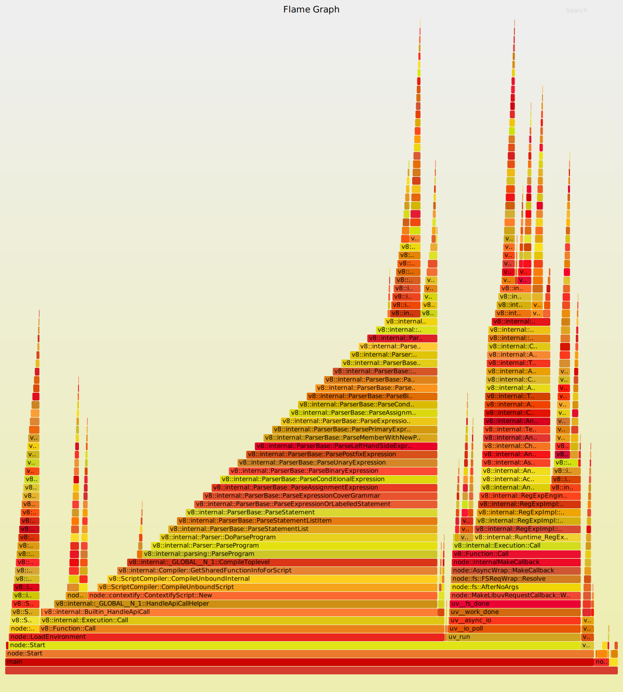

name: title-layout
layout: true
class: center, middle, title

---
name: picture-layout
layout: true
class: center, middle

---
name: basic-layout
layout: true
class: left, top

---
name: title
template: title-layout

# uftrace
### A function (graph) tracer for C/C++ userspace programs
### [https://github.com/namhyung/uftrace](https://github.com/namhyung/uftrace)
.footnote[[https://uftrace.github.io](https://uftrace.github.io)]

---
name: toc
### Table of Contents
- [Installation](#installation)
- [Basic Tracing](#basic-tracing)
  - [(user) Function Tracing](#user-tracing)
  - [Library Function Tracing](#lib-tracing)
  - [Linux Kernel Function Tracing](#kernel-tracing)
  - [Event Tracing](#event-tracing)
- [Filters](#filters)
- [report command](#report)
- [dump command](#dump)
- [Display Function Arguments](#args)
- [Arguments Detection with Debug Info](#autoargs)
- [graph command](#graph)
- [tui command](#tui)
- [(Python) Scripting](#python) (TBD)
- [Dynamic Tracing](#dynamic-tracing)

---
name: toc2
### Table of Contents
- [Installation](#installation)
- [Basic Tracing (record and replay)](#basic-tracing)
  - [(user) Function Tracing](#user-tracing)
  - [Library Function Tracing](#lib-tracing)
  - [Linux Kernel Function Tracing](#kernel-tracing)
  - [Event Tracing](#event-tracing)
- Recorded Data Analysis
  - [report command](#report)
  - [dump command](#dump)
  - [graph command](#graph)
  - [tui command](#tui)
- Advanced Topics
  - [Filters](#filters)
  - [Triggers](#triggers) (TBD)
  - [Display Function Arguments](#args)
  - [Arguments Detection with Debug Info](#autoargs)
  - [(Python) Scripting](#python) (TBD)
  - [Dynamic Tracing](#dynamic-tracing)

---
### uftrace
- The [uftrace](https://github.com/namhyung/uftrace) tool is to trace and analyze execution of a program written in C/C++.
- It was heavily inspired by the [ftrace](https://www.kernel.org/doc/Documentation/trace/ftrace.txt) framework of the Linux kernel (especially function graph tracer) and supports userspace programs.
- It supports various kind of commands and filters to help analysis of the program execution and performance.

---
template: picture-layout


---
### uftrace tips
- using filters
  - filters, triggers, dynamic patch


- accessing arguments
  - argument/return value specification


- corelate kernel execution
  - Linux kernel function graph tracer


- event tracing
  - SDT, kernel tracepoint, read-trigger, scheduler


- data visualization
  - Chrome tracing, flame graph

---
name: installation
### Quick Installation
.footnote[[INSTALL.md](https://github.com/namhyung/uftrace/blob/master/INSTALL.md)]
```bash
$ git clone https://github.com/namhyung/uftrace && cd uftrace
```
---
### Quick Installation
.footnote[[INSTALL.md](https://github.com/namhyung/uftrace/blob/master/INSTALL.md)]
<pre>
<code class="bash">$ git clone https://github.com/namhyung/uftrace && cd uftrace


$ ./configure
uftrace detected system features:
...         prefix: /usr/local
...         libelf: [ .green[on]  ] - more flexible ELF data handling
...          libdw: [ .red[OFF] ] - DWARF debug info support
...   libpython2.7: [ .red[OFF] ] - python scripting support
...    libncursesw: [ .red[OFF] ] - TUI support
...   cxa_demangle: [ .green[on]  ] - full demangler support with libstdc++
</code>
</pre>
---
### Quick Installation
.footnote[[INSTALL.md](https://github.com/namhyung/uftrace/blob/master/INSTALL.md)]
<pre>
<code class="bash">$ git clone https://github.com/namhyung/uftrace && cd uftrace

# For Ubuntu Users
$ sudo apt-get install libdw-dev pandoc \
       libpython2.7-dev libncursesw5-dev

$ ./configure
uftrace detected system features:
...         prefix: /usr/local
...         libelf: [ .green[on]  ] - more flexible ELF data handling
...          libdw: [ .green[on]  ] - DWARF debug info support
...   libpython2.7: [ .green[on]  ] - python scripting support
...    libncursesw: [ .green[on]  ] - TUI support
...   cxa_demangle: [ .green[on]  ] - full demangler support with libstdc++
</code>
</pre>
---
### Quick Installation
.footnote[[INSTALL.md](https://github.com/namhyung/uftrace/blob/master/INSTALL.md)]
<pre>
<code class="bash">$ git clone https://github.com/namhyung/uftrace && cd uftrace

# For Ubuntu Users
$ sudo misc/ubuntu-install-deps.sh


$ ./configure
uftrace detected system features:
...         prefix: /usr/local
...         libelf: [ .green[on]  ] - more flexible ELF data handling
...          libdw: [ .green[on]  ] - DWARF debug info support
...   libpython2.7: [ .green[on]  ] - python scripting support
...    libncursesw: [ .green[on]  ] - TUI support
...   cxa_demangle: [ .green[on]  ] - full demangler support with libstdc++
</code>
</pre>
---
### Quick Installation
.footnote[[INSTALL.md](https://github.com/namhyung/uftrace/blob/master/INSTALL.md)]
<pre>
<code class="bash">$ git clone https://github.com/namhyung/uftrace && cd uftrace

# For Ubuntu Users
$ sudo misc/ubuntu-install-deps.sh


$ ./configure
uftrace detected system features:
...         prefix: /usr/local
...         libelf: [ .green[on]  ] - more flexible ELF data handling
...          libdw: [ .green[on]  ] - DWARF debug info support
...   libpython2.7: [ .green[on]  ] - python scripting support
...    libncursesw: [ .green[on]  ] - TUI support
...   cxa_demangle: [ .green[on]  ] - full demangler support with libstdc++

$ make

$ sudo make install
</code>
</pre>

---
name: examples
template: title-layout
## What kind of projects uftrace can analyze?

---
class: code-15px
### uftrace output of Clang/LLVM
<pre><code>  $ uftrace -t 2ms -F cc1_main .red[clang] fibonacci.c</code></pre>
---
class: code-15px
### uftrace output of Clang/LLVM
```
  $ uftrace -t 2ms -F cc1_main clang fibonacci.c
  # DURATION     TID     FUNCTION
              [ 19045] | cc1_main() {
              [ 19045] |   clang::CompilerInvocation::CreateFromArgs() {
     2.270 ms [ 19045] |     ParseCodeGenArgs();
     8.653 ms [ 19045] |   } /* clang::CompilerInvocation::CreateFromArgs */
              [ 19045] |   clang::ExecuteCompilerInvocation() {
              [ 19045] |     clang::CompilerInstance::ExecuteAction() {
     2.185 ms [ 19045] |       clang::FrontendAction::BeginSourceFile();
              [ 19045] |       clang::FrontendAction::Execute() {
              [ 19045] |         clang::CodeGenAction::ExecuteAction() {
              [ 19045] |           clang::ASTFrontendAction::ExecuteAction() {
              [ 19045] |             clang::ParseAST() {
              [ 19045] |               clang::Parser::Initialize() {
     3.841 ms [ 19045] |                 clang::Preprocessor::Lex();
     3.887 ms [ 19045] |               } /* clang::Parser::Initialize */
              [ 19045] |               clang::BackendConsumer::HandleTranslationUnit() {
              [ 19045] |                 clang::EmitBackendOutput() {
              [ 19045] |                   llvm::LLVMTargetMachine::addPassesToEmitFile() {
     2.044 ms [ 19045] |                     addPassesToGenerateCode();
     2.068 ms [ 19045] |                   } /* llvm::LLVMTargetMachine::addPassesToEmitFile */
              [ 19045] |                   llvm::legacy::PassManager::run() {
     2.196 ms [ 19045] |                     llvm::legacy::PassManagerImpl::run();
     2.196 ms [ 19045] |                   } /* llvm::legacy::PassManager::run */
     5.053 ms [ 19045] |                 } /* clang::EmitBackendOutput */
     5.076 ms [ 19045] |               } /* clang::BackendConsumer::HandleTranslationUnit */
    23.361 ms [ 19045] |             } /* clang::ParseAST */
    23.385 ms [ 19045] |           } /* clang::ASTFrontendAction::ExecuteAction */
    23.385 ms [ 19045] |         } /* clang::CodeGenAction::ExecuteAction */
    23.386 ms [ 19045] |       } /* clang::FrontendAction::Execute */
    25.651 ms [ 19045] |     } /* clang::CompilerInstance::ExecuteAction */
    25.667 ms [ 19045] |   } /* clang::ExecuteCompilerInvocation */
    34.368 ms [ 19045] | } /* cc1_main */
```

---
class: code-14px
### uftrace output of V8 JavaScript Engine
```
  $ uftrace -F v8::Shell::Main -t 50ms ./d8 fibonacci.js
  # DURATION     TID     FUNCTION
              [ 13090] | v8::Shell::Main() {
              [ 13090] |   v8::Isolate::New() {
              [ 13090] |     v8::internal::Isolate::Init() {
              [ 13090] |       v8::internal::Heap::CreateHeapObjects() {
              [ 13090] |         v8::internal::Heap::CreateInitialObjects() {
              [ 13090] |           v8::internal::Heap::CreateFixedStubs() {
    57.433 ms [ 13090] |             v8::internal::CodeStub::GenerateStubsAheadOfTime();
    57.472 ms [ 13090] |           } /* v8::internal::Heap::CreateFixedStubs */
    60.804 ms [ 13090] |         } /* v8::internal::Heap::CreateInitialObjects */
    60.902 ms [ 13090] |       } /* v8::internal::Heap::CreateHeapObjects */
   100.935 ms [ 13090] |     } /* v8::internal::Isolate::Init */
   100.992 ms [ 13090] |   } /* v8::Isolate::New */
              [ 13090] |   v8::Shell::RunMain() {
              [ 13090] |     v8::Shell::CreateEvaluationContext() {
              [ 13090] |       v8::Context::New() {
              [ 13090] |         v8::NewContext() {
              [ 13090] |           v8::internal::Bootstrapper::CreateEnvironment() {
              [ 13090] |             v8::internal::Genesis::Genesis() {
   191.952 ms [ 13090] |               v8::internal::Genesis::InstallNatives();
   203.549 ms [ 13090] |             } /* v8::internal::Genesis::Genesis */
   203.569 ms [ 13090] |           } /* v8::internal::Bootstrapper::CreateEnvironment */
   203.575 ms [ 13090] |         } /* v8::NewContext */
   203.575 ms [ 13090] |       } /* v8::Context::New */
   203.721 ms [ 13090] |     } /* v8::Shell::CreateEvaluationContext */
              [ 13090] |     v8::SourceGroup::Execute() {
              [ 13090] |       v8::Shell::ExecuteString() {
              [ 13090] |         v8::Script::Run() {
    55.348 ms [ 13090] |           v8::internal::Execution::Call();
    55.350 ms [ 13090] |         } /* v8::Script::Run */
    55.910 ms [ 13090] |       } /* v8::Shell::ExecuteString */
    55.940 ms [ 13090] |     } /* v8::SourceGroup::Execute */
   259.667 ms [ 13090] |   } /* v8::Shell::RunMain */
   361.898 ms [ 13090] | } /* v8::Shell::Main */
```

---
name: basic-tracing
template: title-layout
# Basic Tracing
### record and replay

---
### uftrace
- uftrace is able to trace
  - C/C++ (user space) functions
      - compiled with -pg or -finstrument-functions
  - Library functions
  - Linux kernel functions
  - Some of system events

---
name: user-tracing
### C/C++ (user) Function Tracing
- Compiler assists tracing with -pg or -finstrument-functions

  ```
  $ 
  ```

.left-column[
```
void bar() {

}

void foo() {
  bar();
}

int main() {
  foo();
}
```
]
.right-column[
```
```
]

---
### C/C++ (user) Function Tracing
- Compiler assists tracing with -pg or -finstrument-functions

  ```
  $ gcc foobar.c
  ```

.left-column[
```
void bar() {

}

void foo() {
  bar();
}

int main() {
  foo();
}
```
]
.right-column[
```
<bar>:

  ret

<foo>:

  call <bar>
  ret

<main>:

  call <foo>
  ret
```
]

---
### C/C++ (user) Function Tracing
- Compiler assists tracing with -pg or -finstrument-functions

  ```
  $ gcc `-pg` foobar.c
  ```

.left-column[
```
void bar() {

}

void foo() {
  bar();
}

int main() {
  foo();
}
```
]
.right-column[
```
<bar>:
* call <mcount@plt>
  ret

<foo>:
* call <mcount@plt>
  call <bar>
  ret

<main>:
* call <mcount@plt>
  call <foo>
  ret
```
]

---
class: code-26px
### C/C++ (user) Function Tracing
- uftrace record
  - Run a command and record its trace data

```
  $ gcc foobar.c
```
---
class: code-26px
### C/C++ (user) Function Tracing
- uftrace record
  - Run a command and record its trace data

```
  $ gcc `-pg` foobar.c
```
---
class: code-26px
### C/C++ (user) Function Tracing
- uftrace record
  - Run a command and record its trace data

```
  $ gcc -pg foobar.c
  $ ./a.out
```
---
class: code-26px
### C/C++ (user) Function Tracing
- uftrace record
  - Run a command and record its trace data

```
  $ gcc -pg foobar.c
  $ uftrace `record` a.out
```
---
class: code-26px
### C/C++ (user) Function Tracing
- uftrace replay
  - Print recorded function trace

```
  $ gcc -pg foobar.c
  $ uftrace record a.out
  $ uftrace `replay`
  # DURATION    TID     FUNCTION
              [11558] | main() {
              [11558] |   foo() {
     0.156 us [11558] |     bar();
     0.767 us [11558] |   } /* foo */
     1.140 us [11558] | } /* main */
```
---
class: code-26px
### C/C++ (user) Function Tracing
- uftrace live
  - Trace functions both doing record and replay

```
  $ gcc -pg foobar.c

  $ uftrace `live` a.out
  # DURATION    TID     FUNCTION
              [11558] | main() {
              [11558] |   foo() {
     0.156 us [11558] |     bar();
     0.767 us [11558] |   } /* foo */
     1.140 us [11558] | } /* main */
```
---
class: code-26px
### C/C++ (user) Function Tracing
- uftrace .grey[(live)]
  - .red[live] can be omitted

```
  $ gcc -pg foobar.c

  $ uftrace a.out
  # DURATION    TID     FUNCTION
              [11558] | main() {
              [11558] |   foo() {
     0.156 us [11558] |     bar();
     0.767 us [11558] |   } /* foo */
     1.140 us [11558] | } /* main */
```

---
name: lib-tracing
### Library Function Tracing
- Library Function Tracing works via PLT hooking

```
    $ gcc -pg foobar.c
```

.left-column[
```
void bar() {

}

void foo() {
  bar();
}

int main() {
  foo();
}
```
]
.right-column[
```
<bar>:
  call <mcount@plt>

  ret

<foo>:
  call <mcount@plt>
  call <bar>
  ret

<main>:
  call <mcount@plt>
  call <foo>
  ret
```
]
---
### Library Function Tracing
- Library Function Tracing works via .red[PLT hooking]

```
    $ gcc -pg foobar.c
```

.left-column[
```
void bar() {
  `getpid()`;
}

void foo() {
  bar();
}

int main() {
  foo();
}
```
]
.right-column[
```
<bar>:
  call <mcount@plt>
* call <getpid@plt> # call to PLT
  ret

<foo>:
  call <mcount@plt>
  call <bar>
  ret

<main>:
  call <mcount@plt>
  call <foo>
  ret
```
]
---
class: code-26px
### Library Function Tracing
- Library Function Tracing works via PLT hooking

```
    $ gcc -pg foobar.c
```
---
class: code-26px
### Library Function Tracing
- Library Function Tracing works via PLT hooking

```
    $ gcc -pg foobar.c

    $ uftrace a.out
```
---
class: code-26px
### Library Function Tracing
- Library Function Tracing works via PLT hooking

```
    $ gcc -pg foobar.c

    $ uftrace a.out
    # DURATION    TID     FUNCTION
                [11558] | main() {
                [11558] |   foo() {
                [11558] |     bar() {
       6.263 us [11558] |       `getpid`();
       7.016 us [11558] |     } /* bar */
       7.443 us [11558] |   } /* foo */
       7.826 us [11558] | } /* main */
```
---
class: code-26px
### Library Function Tracing
- --no-libcall
  - Do not record library function invocations.


```
    $ gcc -pg foobar.c

    $ uftrace a.out
    # DURATION    TID     FUNCTION
                [11558] | main() {
                [11558] |   foo() {
                [11558] |     bar() {
       6.263 us [11558] |       getpid();
       7.016 us [11558] |     } /* bar */
       7.443 us [11558] |   } /* foo */
       7.826 us [11558] | } /* main */
```
---
class: code-26px
### Library Function Tracing
- --no-libcall
  - Do not record library function invocations.


```
    $ gcc -pg foobar.c
  
    $ uftrace `--no-libcall` a.out
    # DURATION    TID     FUNCTION
                [11558] | main() {
                [11558] |   foo() {
                [11558] |     bar() {
//       6.263 us [11558] |       getpid();
       7.016 us [11558] |     } /* bar */
       7.443 us [11558] |   } /* foo */
       7.826 us [11558] | } /* main */
```
---
class: code-26px
### Library Function Tracing
- --no-libcall
  - Do not record library function invocations.


```
    $ gcc -pg foobar.c

    $ uftrace `--no-libcall` a.out
    # DURATION    TID     FUNCTION
                [11558] | main() {
                [11558] |   foo() {
       7.016 us [11558] |     bar();
       7.443 us [11558] |   } /* foo */
       7.826 us [11558] | } /* main */
```
---
class: code-26px
### Library Function Tracing
- C++ example
  - new and delete library calls

```
  $ cat new-delete.cpp
  int main()
  {
      int* p = new int;
      delete p;
  }
```
---
class: code-26px
### Library Function Tracing
- C++ example
  - new and delete library calls

```
  $ cat new-delete.cpp
  int main()
  {
      int* p = new int;
      delete p;
  }

  $ g++ -pg new-delete.cpp
```
---
class: code-26px
### Library Function Tracing
- C++ example
  - It shows .red[operator new] and .red[operator delete]

```
  $ uftrace a.out
  # DURATION     TID     FUNCTION
              [180964] | main() {
     2.420 us [180964] |   `operator new`();
     3.170 us [180964] |   `operator delete`();
    11.220 us [180964] | } /* main */
```
---
class: code-26px
### Library Function Tracing
- --nest-libcall
  - Trace function calls between libraries.

```
  $ uftrace a.out
  # DURATION     TID     FUNCTION
              [180964] | main() {
     2.420 us [180964] |   operator new();
     3.170 us [180964] |   operator delete();
    11.220 us [180964] | } /* main */
```
---
class: code-26px
### Library Function Tracing
- --nest-libcall
  - Trace function calls between libraries.

```
  $ uftrace `--nest-libcall` a.out
  # DURATION     TID     FUNCTION
              [180978] | main() {
              [180978] |   operator new() {

     4.250 us [180978] |   } /* operator new */
              [180978] |   operator delete() {

     3.547 us [180978] |   } /* operator delete */
    11.857 us [180978] | } /* main */
```
---
class: code-26px
### Library Function Tracing
- --nest-libcall
  - Trace function calls between libraries.

```
  $ uftrace `--nest-libcall` a.out
  # DURATION     TID     FUNCTION
              [180978] | main() {
              [180978] |   operator new() {
     0.957 us [180978] |     `malloc`();
     4.250 us [180978] |   } /* operator new */
              [180978] |   operator delete() {
     1.540 us [180978] |     `free`();
     3.547 us [180978] |   } /* operator delete */
    11.857 us [180978] | } /* main */
```

---
name: kernel-tracing
class: code-26px
### Linux Kernel Function Tracing
- -k, --kernel
  - Trace kernel functions as well as user functions.

```
  $ gcc -pg hello.c
```
---
class: code-26px
### Linux Kernel Function Tracing
- -k, --kernel
  - Trace kernel functions as well as user functions.

```
  $ gcc -pg hello.c
  $ uftrace a.out
  Hello World!
  # DURATION     TID     FUNCTION
              [161960] | main() {
     7.267 us [161960] |   printf();
     6.920 us [161960] |   fflush();
    15.694 us [161960] | } /* main */
```
---
class: code-26px
### Linux Kernel Function Tracing
- -k, --kernel
  - Trace kernel functions as well as user functions.

```
  $ gcc -pg hello.c
  $ `sudo` uftrace `-k` a.out
  Hello World!
  # DURATION     TID     FUNCTION
              [161968] | main() {
              [161968] |   printf() {


    32.457 us [161968] |   } /* printf */
              [161968] |   fflush() {

    25.244 us [161968] |   } /* fflush */
    59.221 us [161968] | } /* main */
```
---
class: code-26px
### Linux Kernel Function Tracing
- -k, --kernel
  - Trace kernel functions as well as user functions.

```
  $ gcc -pg hello.c
  $ `sudo` uftrace `-k` a.out
  Hello World!
  # DURATION     TID     FUNCTION
              [161968] | main() {
              [161968] |   printf() {
     7.770 us [161968] |     `sys_newfstat`();
    11.737 us [161968] |     `__do_page_fault`();
    32.457 us [161968] |   } /* printf */
              [161968] |   fflush() {
    18.637 us [161968] |     `sys_write`();
    25.244 us [161968] |   } /* fflush */
    59.221 us [161968] | } /* main */
```
---
class: code-18px
### Linux Kernel Function Tracing
- -K DEPTH, --kernel-depth=DEPTH
  - Set kernel max function depth separately.

```
  $ sudo uftrace `-K 2` a.out
  Hello World!
```
---
class: code-18px
### Linux Kernel Function Tracing
- -K DEPTH, --kernel-depth=DEPTH
  - Set kernel max function depth separately.

```
  $ sudo uftrace `-K 2` a.out
  Hello World!
  # DURATION     TID     FUNCTION
              [162954] | main() {
              [162954] |   printf() {
              [162954] |     `sys_newfstat`() {
     3.074 us [162954] |       `vfs_fstat`();
     1.200 us [162954] |       `cp_new_stat`();
     6.914 us [162954] |     } /* sys_newfstat */
              [162954] |     `__do_page_fault`() {
     0.643 us [162954] |       `down_read_trylock`();
     0.630 us [162954] |       `_cond_resched`();
     2.440 us [162954] |       `find_vma`();
     9.697 us [162954] |       `handle_mm_fault`();
     0.690 us [162954] |       `up_read`();
    21.813 us [162954] |     } /* __do_page_fault */
    42.064 us [162954] |   } /* printf */
              [162954] |   fflush() {
              [162954] |     `sys_write`() {
     0.933 us [162954] |       `__fdget_pos`();
    18.310 us [162954] |       `vfs_write`();
    27.117 us [162954] |     } /* sys_write */
    30.673 us [162954] |   } /* fflush */
    74.223 us [162954] | } /* main */
```

---
name: event-tracing
class: code-20px
### Event Tracing (sched event)
<pre>
<code class="plain">        $ uftrace tests/t-fork
        # DURATION     TID     FUNCTION
                    [ 14528] | main() {
         127.033 us [ 14528] |   fork();
                    [ 14528] |   wait() {
                    [ 14528] |     /* <x-green>linux:sched-out</x-green> */
                    [ 14540] |   } /* fork */
                    [ 14540] |   a() {
                    [ 14540] |     b() {
                    [ 14540] |       c() {
           1.507 us [ 14540] |         getpid();
           2.987 us [ 14540] |       } /* c */
           3.464 us [ 14540] |     } /* b */
           3.854 us [ 14540] |   } /* a */
          13.394 us [ 14540] | } /* main */
                    [ 14528] |     /* <x-green>linux:sched-in</x-green> */
         799.270 us [ 14528] |   } /* wait */
                    [ 14528] |   a() {
                    [ 14528] |     b() {
                    [ 14528] |       c() {
           2.410 us [ 14528] |         getpid();
           3.470 us [ 14528] |       } /* c */
           3.833 us [ 14528] |     } /* b */
           4.144 us [ 14528] |   } /* a */
         952.797 us [ 14528] | } /* main */
</code>
</pre>
---
class: code-20px
### Event Tracing (sched event)
<pre>
<code class="plain">        $ uftrace `--no-event` tests/t-fork
        # DURATION     TID     FUNCTION
                    [ 14528] | main() {
         127.033 us [ 14528] |   fork();
                    [ 14528] |   wait() {

                    [ 14540] |   } /* fork */
                    [ 14540] |   a() {
                    [ 14540] |     b() {
                    [ 14540] |       c() {
           1.507 us [ 14540] |         getpid();
           2.987 us [ 14540] |       } /* c */
           3.464 us [ 14540] |     } /* b */
           3.854 us [ 14540] |   } /* a */
          13.394 us [ 14540] | } /* main */

         799.270 us [ 14528] |   } /* wait */
                    [ 14528] |   a() {
                    [ 14528] |     b() {
                    [ 14528] |       c() {
           2.410 us [ 14528] |         getpid();
           3.470 us [ 14528] |       } /* c */
           3.833 us [ 14528] |     } /* b */
           4.144 us [ 14528] |   } /* a */
         952.797 us [ 14528] | } /* main */
</code>
</pre>
---
class: code-20px
### Event Tracing (sched event)
<pre>
<code class="plain">        $ uftrace `--no-event` tests/t-fork
        # DURATION     TID     FUNCTION
                    [ 14528] | main() {
         127.033 us [ 14528] |   fork();
                    [ 14528] |   wait() {
                    [ 14540] |   } /* fork */
                    [ 14540] |   a() {
                    [ 14540] |     b() {
                    [ 14540] |       c() {
           1.507 us [ 14540] |         getpid();
           2.987 us [ 14540] |       } /* c */
           3.464 us [ 14540] |     } /* b */
           3.854 us [ 14540] |   } /* a */
          13.394 us [ 14540] | } /* main */
         799.270 us [ 14528] |   } /* wait */
                    [ 14528] |   a() {
                    [ 14528] |     b() {
                    [ 14528] |       c() {
           2.410 us [ 14528] |         getpid();
           3.470 us [ 14528] |       } /* c */
           3.833 us [ 14528] |     } /* b */
           4.144 us [ 14528] |   } /* a */
         952.797 us [ 14528] | } /* main */
</code>
</pre>

---
name: filters
template: title-layout
# Filters
.footnote[[wiki/Tutorial:-Filters](https://github.com/namhyung/uftrace/wiki/Tutorial:-Filters)]

---
### Filters
- -D DEPTH, --depth=DEPTH
  - Set global trace limit in nesting level.

<pre><code class="plain">  $ gcc -pg foobar.c

  $ uftrace a.out
  # DURATION    TID     FUNCTION
              [11558] | main() {
              [11558] |   foo() {
     0.156 us [11558] |     bar();
     0.767 us [11558] |   } /* foo */
     1.140 us [11558] | } /* main */
</code></pre>
---
### Filters
- -D DEPTH, --depth=DEPTH
  - Set global trace limit in nesting level.

<pre><code class="plain">  $ gcc -pg foobar.c

  $ uftrace `-D 2` a.out
  # DURATION    TID     FUNCTION
              [11558] | main() {
              [11558] |   foo() {
     0.156 us [11558] |     bar();
     0.767 us [11558] |   } /* foo */
     1.140 us [11558] | } /* main */
</code></pre>
---
### Filters
- -D DEPTH, --depth=DEPTH
  - Set global trace limit in nesting level.

<pre><code class="plain">  $ gcc -pg foobar.c

  $ uftrace `-D 2` a.out
  # DURATION    TID     FUNCTION
              [11558] | main() {
              [11558] |   foo() {
//     0.156 us [11558] |     bar();
     0.767 us [11558] |   } /* foo */
     1.140 us [11558] | } /* main */
</code></pre>
---
### Filters
- -D DEPTH, --depth=DEPTH
  - Set global trace limit in nesting level.

<pre><code class="plain">  $ gcc -pg foobar.c

  $ uftrace `-D 2` a.out
  # DURATION    TID     FUNCTION
              [11558] | main() {
     0.767 us [11558] |   foo();
     1.140 us [11558] | } /* main */
</code></pre>
---
### Filters
- -F FUNC, --filter=FUNC
  - Set filter to trace selected functions only.

<pre><code class="plain">  $ gcc -pg foobar.c

  $ uftrace a.out
  # DURATION    TID     FUNCTION
              [11558] | main() {
              [11558] |   foo() {
     0.156 us [11558] |     bar();
     0.767 us [11558] |   } /* foo */
     1.140 us [11558] | } /* main */
</code></pre>
---
### Filters
- -F FUNC, --filter=FUNC
  - Set filter to trace selected functions only.

<pre><code class="plain">  $ gcc -pg foobar.c

  $ uftrace `-F foo` a.out
  # DURATION    TID     FUNCTION
              [11558] | main() {
              [11558] |   `foo`() {
     0.156 us [11558] |     bar();
     0.767 us [11558] |   } /* foo */
     1.140 us [11558] | } /* main */
</code></pre>
---
### Filters
- -F FUNC, --filter=FUNC
  - Set filter to trace selected functions only.

<pre><code class="plain">  $ gcc -pg foobar.c

  $ uftrace `-F foo` a.out
  # DURATION    TID     FUNCTION
//              [11558] | main() {
              [11558] |   `foo`() {
     0.156 us [11558] |     bar();
     0.767 us [11558] |   } /* foo */
//     1.140 us [11558] | } /* main */
</code></pre>
---
### Filters
- -F FUNC, --filter=FUNC
  - Set filter to trace selected functions only.

<pre><code class="plain">  $ gcc -pg foobar.c

  $ uftrace `-F foo` a.out
  # DURATION    TID     FUNCTION
              [11558] | `foo`() {
     0.156 us [11558] |   bar();
     0.767 us [11558] | } /* foo */
</code></pre>
---
### Filters
- -N FUNC, --notrace=FUNC
  - Set filter not to trace selected functions (and children)

<pre><code class="plain">  $ gcc -pg foobar.c

  $ uftrace a.out
  # DURATION    TID     FUNCTION
              [11558] | main() {
              [11558] |   foo() {
     0.156 us [11558] |     bar();
     0.767 us [11558] |   } /* foo */
     1.140 us [11558] | } /* main */
</code></pre>
---
### Filters
- -N FUNC, --notrace=FUNC
  - Set filter not to trace selected functions (and children)

<pre><code class="plain">  $ gcc -pg foobar.c

  $ uftrace `-N foo` a.out
  # DURATION    TID     FUNCTION
              [11558] | main() {
              [11558] |   `foo`() {
     0.156 us [11558] |     bar();
     0.767 us [11558] |   } /* foo */
     1.140 us [11558] | } /* main */
</code></pre>
---
### Filters
- -N FUNC, --notrace=FUNC
  - Set filter not to trace selected functions (and children)

<pre><code class="plain">  $ gcc -pg foobar.c

  $ uftrace `-N foo` a.out
  # DURATION    TID     FUNCTION
              [11558] | main() {
//              [11558] |   `foo`() {
//     0.156 us [11558] |     bar();
//     0.767 us [11558] |   } /* foo */
     1.140 us [11558] | } /* main */
</code></pre>
---
### Filters
- -N FUNC, --notrace=FUNC
  - Set filter not to trace selected functions (and children)

<pre><code class="plain">  $ gcc -pg foobar.c

  $ uftrace `-N foo` a.out
  # DURATION    TID     FUNCTION
     1.140 us [11558] | main();
</code></pre>
---
### Filters
- -t TIME, --time-filter=TIME
  - Do not show small functions under the time threshold.

<pre><code class="plain">  $ gcc -pg foobar.c

  $ uftrace a.out
  # DURATION    TID     FUNCTION
              [11558] | main() {
              [11558] |   foo() {
     0.156 us [11558] |     bar();
     0.767 us [11558] |   } /* foo */
     1.140 us [11558] | } /* main */
</code></pre>
---
### Filters
- -t TIME, --time-filter=TIME
  - Do not show small functions under the time threshold.

<pre><code class="plain">  $ gcc -pg foobar.c

  $ uftrace `-t 200ns` a.out
  # DURATION    TID     FUNCTION
              [11558] | main() {
              [11558] |   foo() {
     `0.156 us` [11558] |     bar();
     0.767 us [11558] |   } /* foo */
     1.140 us [11558] | } /* main */
</code></pre>
---
### Filters
- -t TIME, --time-filter=TIME
  - Do not show small functions under the time threshold.

<pre><code class="plain">  $ gcc -pg foobar.c

  $ uftrace `-t 200ns` a.out
  # DURATION    TID     FUNCTION
              [11558] | main() {
              [11558] |   foo() {
//     `0.156 us` [11558] |     bar();
     0.767 us [11558] |   } /* foo */
     1.140 us [11558] | } /* main */
</code></pre>
---
### Filters
- -t TIME, --time-filter=TIME
  - Do not show small functions under the time threshold.

<pre><code class="plain">  $ gcc -pg foobar.c

  $ uftrace `-t 200ns` a.out
  # DURATION    TID     FUNCTION
              [11558] | main() {
     0.767 us [11558] |   foo();
     1.140 us [11558] | } /* main */
</code></pre>

---
name: report
template: title-layout
# uftrace report
### Print statistics and summary for trace data
.footnote[[doc/uftrace-report.md](https://github.com/namhyung/uftrace/blob/master/doc/uftrace-report.md)]

---
### uftrace report
- Print statistics and summary for trace data

```
  $ gcc -pg foobar.c
```
---
### uftrace report
- Print statistics and summary for trace data

```
  $ gcc -pg foobar.c
  $ uftrace record a.out
```
---
### uftrace report
- Print statistics and summary for trace data

```
  $ gcc -pg foobar.c
  $ uftrace record a.out
  $ uftrace report
```
---
### uftrace report
- Print statistics and summary for trace data

```
  $ gcc -pg foobar.c
  $ uftrace record a.out
  $ uftrace report
  Total time  Self time      Calls Function
  ========== ========== ========== =================
    0.890 us   0.326 us          1 main
    0.564 us   0.430 us          1 foo
    0.134 us   0.134 us          1 bar
```
---
### uftrace report
- Print statistics and summary for trace data
  - Sort functions by .red[total time] (default)

```
  $ gcc -pg foobar.c
  $ uftrace record a.out
  $ uftrace report `-s total`
  `Total time`  Self time      Calls Function
  ========== ========== ========== =================
    0.890 us   0.326 us          1 main
    0.564 us   0.430 us          1 foo
    0.134 us   0.134 us          1 bar
```
---
### uftrace report
- Print statistics and summary for trace data
  - Sort functions by .red[self time]

```
  $ gcc -pg foobar.c
  $ uftrace record a.out
  $ uftrace report `-s self`
  Total time  `Self time`      Calls Function
  ========== ========== ========== =================
    0.564 us   0.430 us          1 foo
    0.890 us   0.326 us          1 main
    0.134 us   0.134 us          1 bar
```
---
### uftrace report
- Print statistics and summary for trace data
  - Sort functions by .red[number of calls]

```
  $ gcc -pg foobar.c
  $ uftrace record a.out
  $ uftrace report `-s call`
  Total time  Self time      `Calls` Function
  ========== ========== ========== =================
    0.890 us   0.326 us          1 main
    0.564 us   0.430 us          1 foo
    0.134 us   0.134 us          1 bar
```

---
name: dump
template: title-layout
# uftrace dump
### with visualization
.footnote[[doc/uftrace-dump.md](https://github.com/namhyung/uftrace/blob/master/doc/uftrace-dump.md)]

---
### [Chrome Trace Viewer](https://www.chromium.org/developers/how-tos/trace-event-profiling-tool)
- Below is a trace of clang (LLVM) compiling a small C++ template metaprogram.
  - uftrace dump --chrome
---
### [Chrome Trace Viewer](https://www.chromium.org/developers/how-tos/trace-event-profiling-tool)
.footnote[<a href="https://honggyukim.github.io/uftrace/cppcon2016/clang.tmp.fib.html" target="_blank">open in chrome trace viewer</a>]
- Below is a trace of clang (LLVM) compiling a small C++ template metaprogram.
  - uftrace dump --chrome

<a href="https://honggyukim.github.io/uftrace/cppcon2016/clang.tmp.fib.html" target="_blank">

</a>
---
### [Chrome Trace Viewer](https://www.chromium.org/developers/how-tos/trace-event-profiling-tool)
.footnote[<a href="dump/node-marked.html" target="_blank">open in chrome trace viewer</a>]
- Below is a trace of node running a markdown processing with marked.
  - uftrace dump --chrome

<a href="dump/node-marked.html" target="_blank">

</a>
---
### [Chrome Trace Viewer](https://www.chromium.org/developers/how-tos/trace-event-profiling-tool)
.footnote[[Catapult Project](https://github.com/catapult-project/catapult)]
- uftrace dump --chrome generates trace in [JSON format](https://docs.google.com/document/d/1CvAClvFfyA5R-PhYUmn5OOQtYMH4h6I0nSsKchNAySU/preview).
  - Catapult's [trace2html](https://github.com/catapult-project/catapult/blob/master/tracing/bin/trace2html) script can convert it to HTML.

```

        $ uftrace record a.out
```
---
### [Chrome Trace Viewer](https://www.chromium.org/developers/how-tos/trace-event-profiling-tool)
.footnote[[Catapult Project](https://github.com/catapult-project/catapult)]
- uftrace dump --chrome generates trace in [JSON format](https://docs.google.com/document/d/1CvAClvFfyA5R-PhYUmn5OOQtYMH4h6I0nSsKchNAySU/preview).
  - Catapult's [trace2html](https://github.com/catapult-project/catapult/blob/master/tracing/bin/trace2html) script can convert it to HTML.

```

        $ uftrace record a.out

        $ uftrace dump `--chrome` > uftrace-dump-chrome.json
```
---
### [Chrome Trace Viewer](https://www.chromium.org/developers/how-tos/trace-event-profiling-tool)
.footnote[[Catapult Project](https://github.com/catapult-project/catapult)]
- uftrace dump --chrome generates trace in [JSON format](https://docs.google.com/document/d/1CvAClvFfyA5R-PhYUmn5OOQtYMH4h6I0nSsKchNAySU/preview).
  - Catapult's [trace2html](https://github.com/catapult-project/catapult/blob/master/tracing/bin/trace2html) script can convert it to HTML.

```

        $ uftrace record a.out

        $ uftrace dump --chrome > uftrace-dump-chrome.json

        $ `trace2html` uftrace-dump-chrome.json
```
---
### [Chrome Trace Viewer](https://www.chromium.org/developers/how-tos/trace-event-profiling-tool)
.footnote[[Catapult Project](https://github.com/catapult-project/catapult)]
- uftrace dump --chrome generates trace in [JSON format](https://docs.google.com/document/d/1CvAClvFfyA5R-PhYUmn5OOQtYMH4h6I0nSsKchNAySU/preview).
  - Catapult's [trace2html](https://github.com/catapult-project/catapult/blob/master/tracing/bin/trace2html) script can convert it to HTML.

```

        $ uftrace record a.out

        $ uftrace dump --chrome > uftrace-dump-chrome.json

        $ trace2html uftrace-dump-chrome.json
        `uftrace-dump-chrome.html`
```

---
### [Flame Graph](http://www.brendangregg.com/flamegraphs.html)
- Flame graph of V8 JavaScript engine running splay bench
  - uftrace dump --flame-graph | [flamegraph.pl](https://raw.githubusercontent.com/brendangregg/FlameGraph/master/flamegraph.pl) > out.svg
---
### [Flame Graph](http://www.brendangregg.com/flamegraphs.html)
.footnote[<a href="https://honggyukim.github.io/uftrace/v8/octane-splay/trace_splay.js.svg" target="_blank">open in browser</a>]
- Flame graph of V8 JavaScript engine running splay bench
  - uftrace dump --flame-graph | [flamegraph.pl](https://raw.githubusercontent.com/brendangregg/FlameGraph/master/flamegraph.pl) > out.svg

<a href="https://honggyukim.github.io/uftrace/v8/octane-splay/trace_splay.js.svg" target="_blank">

</a>

---
### [Flame Graph](http://www.brendangregg.com/flamegraphs.html)
- Flame graph of node running a markdown processing with marked
  - uftrace dump --flame-graph | [flamegraph.pl](https://raw.githubusercontent.com/brendangregg/FlameGraph/master/flamegraph.pl) > node-marked.svg
---
### [Flame Graph](http://www.brendangregg.com/flamegraphs.html)
.footnote[<a href="dump/node-marked.svg" target="_blank">open in browser</a>]
- Flame graph of node running a markdown processing with marked
  - uftrace dump --flame-graph | [flamegraph.pl](https://raw.githubusercontent.com/brendangregg/FlameGraph/master/flamegraph.pl) > out.svg

<a href="dump/node-marked.svg" target="_blank">

</a>

---
name: args
template: title-layout
## Display Function Arguments
.footnote[[wiki/Tutorial:-Arguments](https://github.com/namhyung/uftrace/wiki/Tutorial:-Arguments)]

---
### 
```
    $ gcc -pg fibonacci.c
```
---
### 
```
    $ gcc -pg fibonacci.c
    $ uftrace a.out 5
    fib(5) = 5
```
---
### 
```
    $ gcc -pg fibonacci.c
    $ uftrace a.out 5
    fib(5) = 5
    # DURATION    TID     FUNCTION
                [31321] | main() {
       1.478 us [31321] |   atoi();
                [31321] |   fib() {
                [31321] |     fib() {
                [31321] |       fib() {
       0.155 us [31321] |         fib();
       0.123 us [31321] |         fib();
       0.883 us [31321] |       } /* fib */
       0.125 us [31321] |       fib();
       1.483 us [31321] |     } /* fib */
                [31321] |     fib() {
       0.125 us [31321] |       fib();
       0.125 us [31321] |       fib();
       0.774 us [31321] |     } /* fib */
       2.716 us [31321] |   } /* fib */
       4.382 us [31321] |   printf();
       9.456 us [31321] | } /* main */
```
---
### Record function arguments with -A / --argument
```
    $ gcc -pg fibonacci.c
    $ uftrace `-A fib@arg1` a.out 5
    fib(5) = 5
    # DURATION    TID     FUNCTION
                [31321] | main() {
       1.478 us [31321] |   atoi();
                [31321] |   fib(`5`) {
                [31321] |     fib(`4`) {
                [31321] |       fib(`3`) {
       0.155 us [31321] |         fib(`2`);
       0.123 us [31321] |         fib(`1`);
       0.883 us [31321] |       } /* fib */
       0.125 us [31321] |       fib(`2`);
       1.483 us [31321] |     } /* fib */
                [31321] |     fib(`3`) {
       0.125 us [31321] |       fib(`2`);
       0.125 us [31321] |       fib(`1`);
       0.774 us [31321] |     } /* fib */
       2.716 us [31321] |   } /* fib */
       4.382 us [31321] |   printf();
       9.456 us [31321] | } /* main */
```
---
### Record function return values with -R / --retval
```
    $ gcc -pg fibonacci.c
    $ uftrace -A fib@arg1 `-R fib@retval` a.out 5
    fib(5) = 5
    # DURATION    TID     FUNCTION
                [31321] | main() {
       1.478 us [31321] |   atoi();
                [31321] |   fib(5) {
                [31321] |     fib(4) {
                [31321] |       fib(3) {
       0.155 us [31321] |         fib(2) `= 1`;
       0.123 us [31321] |         fib(1) `= 1`;
       0.883 us [31321] |       } = `2`; /* fib */
       0.125 us [31321] |       fib(2) `= 1`;
       1.483 us [31321] |     } `= 3`; /* fib */
                [31321] |     fib(3) {
       0.125 us [31321] |       fib(2) `= 1`;
       0.125 us [31321] |       fib(1) `= 1`;
       0.774 us [31321] |     } `= 2`; /* fib */
       2.716 us [31321] |   } `= 5`; /* fib */
       4.382 us [31321] |   printf();
       9.456 us [31321] | } /* main */
```
---
class: code-18px
### Display Function Arguments
- uftrace can record function arguments and return values
  - using the .red[-A]/.red[--argument] and .red[-R]/.red[--retval] options.

```
    <argument>    :=  <symbol> "@" <specs>
    <specs>       :=  <spec> | <spec> "," <spec>
    <spec>        :=  ( <int_spec> | <float_spec> | <ret_spec> )
    <int_spec>    :=  "arg" N [ "/" <format> [ <size> ] ] [ "%" ( <reg> | <stack> ) ]
    <float_spec>  :=  "fparg" N [ "/" ( <size> | "80" ) ] [ "%" ( <reg> | <stack> ) ]
    <ret_spec>    :=  "retval" [ "/" <format> [ <size> ] ]
    <format>      :=  "d" | "i" | "u" | "x" | "s" | "c" | "f" | "S" | "p"
    <size>        :=  "8" | "16" | "32" | "64"
    <reg>         :=  <arch-specific register name>  # "rdi", "xmm0", "r0", ...
    <stack>       :=  "stack" [ "+" ] <offset>
```
---
class: code-18px
### Display Function Arguments
```
    $ uftrace -A fib@arg1 -R fib@retval a.out 5


    <argument>    :=  <symbol> "@" <specs>
    <specs>       :=  <spec> | <spec> "," <spec>
    <spec>        :=  ( <int_spec> | <float_spec> | <ret_spec> )
    <int_spec>    :=  "arg" N [ "/" <format> [ <size> ] ] [ "%" ( <reg> | <stack> ) ]
    <float_spec>  :=  "fparg" N [ "/" ( <size> | "80" ) ] [ "%" ( <reg> | <stack> ) ]
    <ret_spec>    :=  "retval" [ "/" <format> [ <size> ] ]
    <format>      :=  "d" | "i" | "u" | "x" | "s" | "c" | "f" | "S" | "p"
    <size>        :=  "8" | "16" | "32" | "64"
    <reg>         :=  <arch-specific register name>  # "rdi", "xmm0", "r0", ...
    <stack>       :=  "stack" [ "+" ] <offset>
```
---
class: code-18px
### Display Function Arguments
```
    $ uftrace -A `fib`@arg1 -R `fib`@retval a.out 5


    <argument>    :=  `<symbol>` "@" <specs>
    <specs>       :=  <spec> | <spec> "," <spec>
    <spec>        :=  ( <int_spec> | <float_spec> | <ret_spec> )
    <int_spec>    :=  "arg" N [ "/" <format> [ <size> ] ] [ "%" ( <reg> | <stack> ) ]
    <float_spec>  :=  "fparg" N [ "/" ( <size> | "80" ) ] [ "%" ( <reg> | <stack> ) ]
    <ret_spec>    :=  "retval" [ "/" <format> [ <size> ] ]
    <format>      :=  "d" | "i" | "u" | "x" | "s" | "c" | "f" | "S" | "p"
    <size>        :=  "8" | "16" | "32" | "64"
    <reg>         :=  <arch-specific register name>  # "rdi", "xmm0", "r0", ...
    <stack>       :=  "stack" [ "+" ] <offset>
```
</span>
---
class: code-18px
### Display Function Arguments
```
    $ uftrace -A fib@`arg1` -R fib@`retval` a.out 5


    <argument>    :=  <symbol> "@" `<specs>`
    <specs>       :=  `<spec>` | <spec> "," <spec>
    <spec>        :=  ( <int_spec> | <float_spec> | <ret_spec> )
    <int_spec>    :=  "`arg`" `N` [ "/" <format> [ <size> ] ] [ "%" ( <reg> | <stack> ) ]
    <float_spec>  :=  "fparg" N [ "/" ( <size> | "80" ) ] [ "%" ( <reg> | <stack> ) ]
    <ret_spec>    :=  "`retval`" [ "/" <format> [ <size> ] ]
    <format>      :=  "d" | "i" | "u" | "x" | "s" | "c" | "f" | "S" | "p"
    <size>        :=  "8" | "16" | "32" | "64"
    <reg>         :=  <arch-specific register name>  # "rdi", "xmm0", "r0", ...
    <stack>       :=  "stack" [ "+" ] <offset>
```
---
class: code-18px
### Display Function Arguments
```
    $ uftrace -A fib@arg1 -R fib@retval a.out 5


    <argument>    :=  <symbol> "@" <specs>
    <specs>       :=  <spec> | <spec> "," <spec>
    <spec>        :=  ( <int_spec> | <float_spec> | <ret_spec> )
    <int_spec>    :=  "arg" N [ "`/`" `<format>` [ `<size>` ] ] [ "%" ( <reg> | <stack> ) ]
    <float_spec>  :=  "fparg" N [ "/" ( <size> | "80" ) ] [ "%" ( <reg> | <stack> ) ]
    <ret_spec>    :=  "retval" [ "`/`" `<format>` [ `<size>` ] ]
    `<format>`      :=  "d" | "i" | "u" | "x" | "s" | "c" | "f" | "S" | "p"
    `<size>`        :=  "8" | "16" | "32" | "64"
    <reg>         :=  <arch-specific register name>  # "rdi", "xmm0", "r0", ...
    <stack>       :=  "stack" [ "+" ] <offset>
```

---
name: autoargs
template: title-layout
## Arguments Detection with Debug Info
#### -a / --auto-args option
.footnote[[wiki/Tutorial:-Arguments](https://github.com/namhyung/uftrace/wiki/Tutorial:-Arguments)]
<pre><code class="bash">$ ./configure 
libdw: [ .green[on]  ]</code></pre>

---
### Detect function types using debug info with -a / --auto-args
```
    $ gcc -pg fibonacci.c
```
---
### Detect function types using debug info with -a / --auto-args
.footnote[gcc .red[-g] produces debug info ([DWARF](http://dwarfstd.org))]
```
    $ gcc -pg `-g` fibonacci.c
```
---
### Detect function types using debug info with -a / --auto-args
.footnote[.red[-a]/.red[--auto-args] uses debug info to detect type info of user functions]
```
    $ gcc -pg `-g` fibonacci.c
    $ uftrace `-a` a.out 5
```
---
### Detect function types using debug info with -a / --auto-args
<pre><code>    $ gcc -pg `-g` fibonacci.c
    $ uftrace `-a` a.out 5
    <x-orange>fib(5) = 5</x-orange>
    # DURATION    TID     FUNCTION
                [31321] | main(`2`, `0x7ffd62a92a18`) {
       1.478 us [31321] |   atoi();
                [31321] |   fib(`5`) {
                [31321] |     fib(`4`) {
                [31321] |       fib(`3`) {
       0.155 us [31321] |         fib(`2`) `= 1`;
       0.123 us [31321] |         fib(`1`) `= 1`;
       0.883 us [31321] |       } = `2`; /* fib */
       0.125 us [31321] |       fib(`2`) `= 1`;
       1.483 us [31321] |     } `= 3`; /* fib */
                [31321] |     fib(`3`) {
       0.125 us [31321] |       fib(`2`) `= 1`;
       0.125 us [31321] |       fib(`1`) `= 1`;
       0.774 us [31321] |     } `= 2`; /* fib */
       2.716 us [31321] |   } `= 5`; /* fib */
       4.382 us [31321] |   printf(<x-orange>"fib(%d) = %d\n"</x-orange>) `= 11`;
       9.456 us [31321] | } `= 0`; /* main */
</code></pre>

---
name: graph
template: title-layout
# uftrace graph
### Show function call graph
.footnote[[doc/uftrace-graph.md](https://github.com/namhyung/uftrace/blob/master/doc/uftrace-graph.md)]

---
### Call graph of std::shared_ptr
```cpp
    $ cat shared_ptr.cc
    #include <memory>

    int main()
    {
        std::shared_ptr<int> sp1(new int);
        {
          std::shared_ptr<int> sp2(sp1);
        }
    }
```
---
### Call graph of std::shared_ptr
```cpp
    $ cat shared_ptr.cc
    #include <memory>

    int main()
    {
        std::shared_ptr<int> sp1(new int);
        {
          std::shared_ptr<int> sp2(sp1);
        }
    }
```
```
    $ g++ -std=c++11 -pg -g shared_ptr.cc
```
---
### Call graph of std::shared_ptr
```cpp
    $ cat shared_ptr.cc
    #include <memory>

    int main()
    {
        std::shared_ptr<int> sp1(new int);
        {
          std::shared_ptr<int> sp2(sp1);
        }
    }
```
```
    $ g++ -std=c++11 -pg -g shared_ptr.cc

    $ uftrace record a.out
```
---
### Call graph of std::shared_ptr
```cpp
    $ cat shared_ptr.cc
    #include <memory>

    int main()
    {
        std::shared_ptr<int> sp1(new int);
        {
          std::shared_ptr<int> sp2(sp1);
        }
    }
```
```
    $ g++ -std=c++11 -pg -g shared_ptr.cc

    $ uftrace record a.out

    $ uftrace replay
```

---
class: code-13px
.footnote[replay output is too long]
```
    $ uftrace replay
    # DURATION     TID     FUNCTION
                [  1095] | main() {
                [  1095] |   std::shared_ptr::shared_ptr() {
                [  1095] |     std::__shared_ptr::__shared_ptr() {
                [  1095] |       std::__shared_count::__shared_count() {
                [  1095] |         std::_Sp_counted_ptr::_Sp_counted_ptr() {
                [  1095] |           std::_Sp_counted_base::_Sp_counted_base() {
       0.070 us [  1095] |             std::_Mutex_base::_Mutex_base();
       0.645 us [  1095] |           } /* std::_Sp_counted_base::_Sp_counted_base */
       0.780 us [  1095] |         } /* std::_Sp_counted_ptr::_Sp_counted_ptr */
       0.955 us [  1095] |       } /* std::__shared_count::__shared_count */
       0.044 us [  1095] |       std::__enable_shared_from_this_helper();
       1.206 us [  1095] |     } /* std::__shared_ptr::__shared_ptr */
       1.339 us [  1095] |   } /* std::shared_ptr::shared_ptr */
                [  1095] |   std::shared_ptr::shared_ptr() {
                [  1095] |     std::__shared_ptr::__shared_ptr() {
                [  1095] |       std::__shared_count::__shared_count() {
                [  1095] |         std::_Sp_counted_base::_M_add_ref_copy() {
                [  1095] |           __gnu_cxx::__atomic_add_dispatch() {
       0.047 us [  1095] |             __gthread_active_p();
       0.042 us [  1095] |             __gnu_cxx::__atomic_add();
       0.379 us [  1095] |           } /* __gnu_cxx::__atomic_add_dispatch */
       0.549 us [  1095] |         } /* std::_Sp_counted_base::_M_add_ref_copy */
       0.647 us [  1095] |       } /* std::__shared_count::__shared_count */
       0.743 us [  1095] |     } /* std::__shared_ptr::__shared_ptr */
       0.842 us [  1095] |   } /* std::shared_ptr::shared_ptr */
                [  1095] |   std::shared_ptr::~shared_ptr() {
                [  1095] |     std::__shared_ptr::~__shared_ptr() {
                [  1095] |       std::__shared_count::~__shared_count() {
                [  1095] |         std::_Sp_counted_base::_M_release() {
                [  1095] |           __gnu_cxx::__exchange_and_add_dispatch() {
       0.038 us [  1095] |             __gthread_active_p();
       0.042 us [  1095] |             __gnu_cxx::__exchange_and_add();
       0.320 us [  1095] |           } /* __gnu_cxx::__exchange_and_add_dispatch */
       0.423 us [  1095] |         } /* std::_Sp_counted_base::_M_release */
       0.522 us [  1095] |       } /* std::__shared_count::~__shared_count */
       0.616 us [  1095] |     } /* std::__shared_ptr::~__shared_ptr */
       0.715 us [  1095] |   } /* std::shared_ptr::~shared_ptr */
                [  1095] |   std::shared_ptr::~shared_ptr() {
                [  1095] |     std::__shared_ptr::~__shared_ptr() {
            ...
```
---
class: code-13px
.footnote[using time filter]
```
    $ uftrace replay `-t 400ns`
    # DURATION     TID     FUNCTION
                [  1095] | main() {
                [  1095] |   std::shared_ptr::shared_ptr() {
                [  1095] |     std::__shared_ptr::__shared_ptr() {
                [  1095] |       std::__shared_count::__shared_count() {
                [  1095] |         std::_Sp_counted_ptr::_Sp_counted_ptr() {
       0.645 us [  1095] |           std::_Sp_counted_base::_Sp_counted_base();
       0.780 us [  1095] |         } /* std::_Sp_counted_ptr::_Sp_counted_ptr */
       0.955 us [  1095] |       } /* std::__shared_count::__shared_count */
       1.206 us [  1095] |     } /* std::__shared_ptr::__shared_ptr */
       1.339 us [  1095] |   } /* std::shared_ptr::shared_ptr */
                [  1095] |   std::shared_ptr::shared_ptr() {
                [  1095] |     std::__shared_ptr::__shared_ptr() {
                [  1095] |       std::__shared_count::__shared_count() {
       0.549 us [  1095] |         std::_Sp_counted_base::_M_add_ref_copy();
       0.647 us [  1095] |       } /* std::__shared_count::__shared_count */
       0.743 us [  1095] |     } /* std::__shared_ptr::__shared_ptr */
       0.842 us [  1095] |   } /* std::shared_ptr::shared_ptr */
                [  1095] |   std::shared_ptr::~shared_ptr() {
                [  1095] |     std::__shared_ptr::~__shared_ptr() {
                [  1095] |       std::__shared_count::~__shared_count() {
       0.423 us [  1095] |         std::_Sp_counted_base::_M_release();
       0.522 us [  1095] |       } /* std::__shared_count::~__shared_count */
       0.616 us [  1095] |     } /* std::__shared_ptr::~__shared_ptr */
       0.715 us [  1095] |   } /* std::shared_ptr::~shared_ptr */
                [  1095] |   std::shared_ptr::~shared_ptr() {
                [  1095] |     std::__shared_ptr::~__shared_ptr() {
                [  1095] |       std::__shared_count::~__shared_count() {
                [  1095] |         std::_Sp_counted_base::_M_release() {
                [  1095] |           std::_Sp_counted_ptr::_M_dispose() {
       1.021 us [  1095] |             operator delete();
       1.522 us [  1095] |           } /* std::_Sp_counted_ptr::_M_dispose */
                [  1095] |           std::_Sp_counted_ptr::_M_destroy() {
       0.494 us [  1095] |             std::_Sp_counted_ptr::~_Sp_counted_ptr();
       0.597 us [  1095] |           } /* std::_Sp_counted_ptr::_M_destroy */
       3.037 us [  1095] |         } /* std::_Sp_counted_base::_M_release */
       3.131 us [  1095] |       } /* std::__shared_count::~__shared_count */
       3.222 us [  1095] |     } /* std::__shared_ptr::~__shared_ptr */
       3.315 us [  1095] |   } /* std::shared_ptr::~shared_ptr */
       7.019 us [  1095] | } /* main */
```

---
class: code-14px
.footnote[aggregated call graph]
```
    $ uftrace `graph`
    # Function Call Graph for 'a.out' (session: c3d2c13b51a25a6b)
    ========== FUNCTION CALL GRAPH ==========
    # TOTAL TIME   FUNCTION
        7.019 us : (1) a.out
        7.019 us : (1) main
        2.181 us :  +-(2) std::shared_ptr::shared_ptr
        1.949 us :  | (2) std::__shared_ptr::__shared_ptr
        1.602 us :  |  +-(2) std::__shared_count::__shared_count
        0.780 us :  |  |  +-(1) std::_Sp_counted_ptr::_Sp_counted_ptr
        0.645 us :  |  |  | (1) std::_Sp_counted_base::_Sp_counted_base
        0.070 us :  |  |  | (1) std::_Mutex_base::_Mutex_base
                 :  |  |  |
        0.549 us :  |  |  +-(1) std::_Sp_counted_base::_M_add_ref_copy
        0.379 us :  |  |    (1) __gnu_cxx::__atomic_add_dispatch
        0.047 us :  |  |     +-(1) __gthread_active_p
                 :  |  |     |
        0.042 us :  |  |     +-(1) __gnu_cxx::__atomic_add
                 :  |  |
        0.044 us :  |  +-(1) std::__enable_shared_from_this_helper
                 :  |
        4.030 us :  +-(2) std::shared_ptr::~shared_ptr
        3.838 us :    (2) std::__shared_ptr::~__shared_ptr
        3.653 us :    (2) std::__shared_count::~__shared_count
        3.460 us :    (2) std::_Sp_counted_base::_M_release
        0.879 us :     +-(3) __gnu_cxx::__exchange_and_add_dispatch
        0.116 us :     |  +-(3) __gthread_active_p
                 :     |  |
        0.126 us :     |  +-(3) __gnu_cxx::__exchange_and_add
                 :     |
        1.522 us :     +-(1) std::_Sp_counted_ptr::_M_dispose
        1.021 us :     | (1) operator delete
                 :     |
        0.597 us :     +-(1) std::_Sp_counted_ptr::_M_destroy
        0.494 us :       (1) std::_Sp_counted_ptr::~_Sp_counted_ptr
        0.217 us :        +-(1) std::_Sp_counted_ptr::~_Sp_counted_ptr
        0.041 us :        | (1) std::_Sp_counted_base::~_Sp_counted_base
                 :        |
        0.068 us :        +-(1) operator delete
```
---
class: code-14px
.footnote[.red[number of calls for each graph]]
```
    $ uftrace graph
    # Function Call Graph for 'a.out' (session: c3d2c13b51a25a6b)
    ========== FUNCTION CALL GRAPH ==========
    # TOTAL TIME   FUNCTION
        7.019 us : (`1`) a.out
        7.019 us : (`1`) main
        2.181 us :  +-(`2`) std::shared_ptr::shared_ptr
        1.949 us :  | (`2`) std::__shared_ptr::__shared_ptr
        1.602 us :  |  +-(`2`) std::__shared_count::__shared_count
        0.780 us :  |  |  +-(`1`) std::_Sp_counted_ptr::_Sp_counted_ptr
        0.645 us :  |  |  | (`1`) std::_Sp_counted_base::_Sp_counted_base
        0.070 us :  |  |  | (`1`) std::_Mutex_base::_Mutex_base
                 :  |  |  |
        0.549 us :  |  |  +-(`1`) std::_Sp_counted_base::_M_add_ref_copy
        0.379 us :  |  |    (`1`) __gnu_cxx::__atomic_add_dispatch
        0.047 us :  |  |     +-(`1`) __gthread_active_p
                 :  |  |     |
        0.042 us :  |  |     +-(`1`) __gnu_cxx::__atomic_add
                 :  |  |
        0.044 us :  |  +-(`1`) std::__enable_shared_from_this_helper
                 :  |
        4.030 us :  +-(`2`) std::shared_ptr::~shared_ptr
        3.838 us :    (`2`) std::__shared_ptr::~__shared_ptr
        3.653 us :    (`2`) std::__shared_count::~__shared_count
        3.460 us :    (`2`) std::_Sp_counted_base::_M_release
        0.879 us :     +-(`3`) __gnu_cxx::__exchange_and_add_dispatch
        0.116 us :     |  +-(`3`) __gthread_active_p
                 :     |  |
        0.126 us :     |  +-(`3`) __gnu_cxx::__exchange_and_add
                 :     |
        1.522 us :     +-(`1`) std::_Sp_counted_ptr::_M_dispose
        1.021 us :     | (`1`) operator delete
                 :     |
        0.597 us :     +-(`1`) std::_Sp_counted_ptr::_M_destroy
        0.494 us :       (`1`) std::_Sp_counted_ptr::~_Sp_counted_ptr
        0.217 us :        +-(`1`) std::_Sp_counted_ptr::~_Sp_counted_ptr
        0.041 us :        | (`1`) std::_Sp_counted_base::~_Sp_counted_base
                 :        |
        0.068 us :        +-(`1`) operator delete
```
---
class: code-14px
.footnote[.red[total time of each call graph]]
```
    $ uftrace graph
    # Function Call Graph for 'a.out' (session: c3d2c13b51a25a6b)
    ========== FUNCTION CALL GRAPH ==========
    # `TOTAL TIME`   FUNCTION
        7.019 us : (1) a.out
        7.019 us : (1) main
        `2.181 us` :  +-(2) `std::shared_ptr::shared_ptr`
        1.949 us :  | (2) std::__shared_ptr::__shared_ptr
        1.602 us :  |  +-(2) std::__shared_count::__shared_count
        0.780 us :  |  |  +-(1) std::_Sp_counted_ptr::_Sp_counted_ptr
        0.645 us :  |  |  | (1) std::_Sp_counted_base::_Sp_counted_base
        0.070 us :  |  |  | (1) std::_Mutex_base::_Mutex_base
                 :  |  |  |
        0.549 us :  |  |  +-(1) std::_Sp_counted_base::_M_add_ref_copy
        0.379 us :  |  |    (1) __gnu_cxx::__atomic_add_dispatch
        0.047 us :  |  |     +-(1) __gthread_active_p
                 :  |  |     |
        0.042 us :  |  |     +-(1) __gnu_cxx::__atomic_add
                 :  |  |
        0.044 us :  |  +-(1) std::__enable_shared_from_this_helper
                 :  |
        `4.030 us` :  +-(2) `std::shared_ptr::~shared_ptr`
        3.838 us :    (2) std::__shared_ptr::~__shared_ptr
        3.653 us :    (2) std::__shared_count::~__shared_count
        3.460 us :    (2) std::_Sp_counted_base::_M_release
        0.879 us :     +-(3) __gnu_cxx::__exchange_and_add_dispatch
        0.116 us :     |  +-(3) __gthread_active_p
                 :     |  |
        0.126 us :     |  +-(3) __gnu_cxx::__exchange_and_add
                 :     |
        1.522 us :     +-(1) std::_Sp_counted_ptr::_M_dispose
        1.021 us :     | (1) operator delete
                 :     |
        0.597 us :     +-(1) std::_Sp_counted_ptr::_M_destroy
        0.494 us :       (1) std::_Sp_counted_ptr::~_Sp_counted_ptr
        0.217 us :        +-(1) std::_Sp_counted_ptr::~_Sp_counted_ptr
        0.041 us :        | (1) std::_Sp_counted_base::~_Sp_counted_base
                 :        |
        0.068 us :        +-(1) operator delete
```
---
class: code-14px
```
    $ uftrace graph `-f +self`
    # Function Call Graph for 'a.out' (session: c3d2c13b51a25a6b)
    ========== FUNCTION CALL GRAPH ==========
    # TOTAL TIME   `SELF TIME`   FUNCTION
        7.019 us             : (1) a.out
        7.019 us    0.808 us : (1) main
        2.181 us    0.232 us :  +-(2) std::shared_ptr::shared_ptr
        1.949 us    0.303 us :  | (2) std::__shared_ptr::__shared_ptr
        1.602 us    0.273 us :  |  +-(2) std::__shared_count::__shared_count
        0.780 us    0.135 us :  |  |  +-(1) std::_Sp_counted_ptr::_Sp_counted_ptr
        0.645 us    0.575 us :  |  |  | (1) std::_Sp_counted_base::_Sp_counted_base
        0.070 us    0.070 us :  |  |  | (1) std::_Mutex_base::_Mutex_base
                             :  |  |  |
        0.549 us    0.170 us :  |  |  +-(1) std::_Sp_counted_base::_M_add_ref_copy
        0.379 us    0.290 us :  |  |    (1) __gnu_cxx::__atomic_add_dispatch
        0.047 us    0.047 us :  |  |     +-(1) __gthread_active_p
                             :  |  |     |
        0.042 us    0.042 us :  |  |     +-(1) __gnu_cxx::__atomic_add
                             :  |  |
        0.044 us    0.044 us :  |  +-(1) std::__enable_shared_from_this_helper
                             :  |
        4.030 us    0.192 us :  +-(2) std::shared_ptr::~shared_ptr
        3.838 us    0.185 us :    (2) std::__shared_ptr::~__shared_ptr
        3.653 us    0.193 us :    (2) std::__shared_count::~__shared_count
        3.460 us    0.462 us :    (2) std::_Sp_counted_base::_M_release
        0.879 us    0.637 us :     +-(3) __gnu_cxx::__exchange_and_add_dispatch
        0.116 us    0.116 us :     |  +-(3) __gthread_active_p
                             :     |  |
        0.126 us    0.126 us :     |  +-(3) __gnu_cxx::__exchange_and_add
                             :     |
        1.522 us    0.501 us :     +-(1) std::_Sp_counted_ptr::_M_dispose
        1.021 us    1.021 us :     | (1) operator delete
                             :     |
        0.597 us    0.103 us :     +-(1) std::_Sp_counted_ptr::_M_destroy
        0.494 us    0.209 us :       (1) std::_Sp_counted_ptr::~_Sp_counted_ptr
        0.217 us    0.176 us :        +-(1) std::_Sp_counted_ptr::~_Sp_counted_ptr
        0.041 us    0.041 us :        | (1) std::_Sp_counted_base::~_Sp_counted_base
                             :        |
        0.068 us    0.068 us :        +-(1) operator delete
```
---
class: code-14px
```
    $ uftrace graph `-f +self,addr`
    # Function Call Graph for 'a.out' (session: c3d2c13b51a25a6b)
    ========== FUNCTION CALL GRAPH ==========
    # TOTAL TIME   `SELF TIME`     `ADDRESS`     FUNCTION
        7.019 us              562731a8bee9 : (1) a.out
        7.019 us    0.808 us  562731a8bee9 : (1) main
        2.181 us    0.232 us  562731a8c01e :  +-(2) std::shared_ptr::shared_ptr
        1.949 us    0.303 us  562731a8c0bc :  | (2) std::__shared_ptr::__shared_ptr
        1.602 us    0.273 us  562731a8c1c5 :  |  +-(2) std::__shared_count::__shared_count
        0.780 us    0.135 us  562731a8c2d4 :  |  |  +-(1) std::_Sp_counted_ptr::_Sp_counted_ptr
        0.645 us    0.575 us  562731a8c37a :  |  |  | (1) std::_Sp_counted_base::_Sp_counted_base
        0.070 us    0.070 us  562731a8c364 :  |  |  | (1) std::_Mutex_base::_Mutex_base
                                           :  |  |  |
        0.549 us    0.170 us  562731a8c19a :  |  |  +-(1) std::_Sp_counted_base::_M_add_ref_copy
        0.379 us    0.290 us  562731a8be9f :  |  |    (1) __gnu_cxx::__atomic_add_dispatch
        0.047 us    0.047 us  562731a8bd8a :  |  |     +-(1) __gthread_active_p
                                           :  |  |     |
        0.042 us    0.042 us  562731a8bdd7 :  |  |     +-(1) __gnu_cxx::__atomic_add
                                           :  |  |
        0.044 us    0.044 us  562731a8c241 :  |  +-(1) std::__enable_shared_from_this_helper
                                           :  |
        4.030 us    0.192 us  562731a8bf8e :  +-(2) std::shared_ptr::~shared_ptr
        3.838 us    0.185 us  562731a8bf68 :    (2) std::__shared_ptr::~__shared_ptr
        3.653 us    0.193 us  562731a8c04a :    (2) std::__shared_count::~__shared_count
        3.460 us    0.462 us  562731a8c118 :    (2) std::_Sp_counted_base::_M_release
        0.879 us    0.637 us  562731a8be56 :     +-(3) __gnu_cxx::__exchange_and_add_dispatch
        0.116 us    0.116 us  562731a8bd8a :     |  +-(3) __gthread_active_p
                                           :     |  |
        0.126 us    0.126 us  562731a8bdb3 :     |  +-(3) __gnu_cxx::__exchange_and_add
                                           :     |
        1.522 us    0.501 us  562731a8c41c :     +-(1) std::_Sp_counted_ptr::_M_dispose
        1.021 us    1.021 us  562731a8bbb0 :     | (1) operator delete
                                           :     |
        0.597 us    0.103 us  562731a8c442 :     +-(1) std::_Sp_counted_ptr::_M_destroy
        0.494 us    0.209 us  562731a8c3f0 :       (1) std::_Sp_counted_ptr::~_Sp_counted_ptr
        0.217 us    0.176 us  562731a8c3c0 :        +-(1) std::_Sp_counted_ptr::~_Sp_counted_ptr
        0.041 us    0.041 us  562731a8c314 :        | (1) std::_Sp_counted_base::~_Sp_counted_base
                                           :        |
        0.068 us    0.068 us  562731a8bbb0 :        +-(1) operator delete
```

---
name: tui
template: title-layout
# uftrace tui
### (Interactive) Text-based User Interface
.footnote[[doc/uftrace-tui.md](https://github.com/namhyung/uftrace/blob/master/doc/uftrace-tui.md)]
<pre><code class="bash">$ ./configure       
libncursesw: [ .green[on]  ]</code></pre>

---
class: tui
<pre>
<code class="plain">  <x-tui-blue-line>  TOTAL TIME : FUNCTION</x-tui-blue-line>
  <x-tui-white-line>    7.019 us : (1) a.out</x-tui-white-line>
      7.019 us : (1) main
      2.181 us :  ├─(2) std::shared_ptr::shared_ptr
      1.949 us :  │ (2) std::\__shared_ptr::\__shared_ptr
      1.602 us :  │  ├─(2) std::\__shared_count::\__shared_count
      0.780 us :  │  │  ├─(1) std::_Sp_counted_ptr::_Sp_counted_ptr
      0.645 us :  │  │  │ (1) std::_Sp_counted_base::_Sp_counted_base
      0.070 us :  │  │  │ (1) std::_Mutex_base::_Mutex_base
               :  │  │  │
      0.549 us :  │  │  └─(1) std::_Sp_counted_base::_M_add_ref_copy
      0.379 us :  │  │    (1) \__gnu_cxx::\__atomic_add_dispatch
      0.047 us :  │  │     ├─(1) \__gthread_active_p
               :  │  │     │
      0.042 us :  │  │     └─(1) \__gnu_cxx::\__atomic_add
               :  │  │
      0.044 us :  │  └─(1) std::\__enable_shared_from_this_helper
               :  │
      4.030 us :  └─(2) std::shared_ptr::~shared_ptr
      3.838 us :    (2) std::\__shared_ptr::~\__shared_ptr
      3.653 us :    (2) std::\__shared_count::~\__shared_count
      3.460 us :    (2) std::_Sp_counted_base::_M_release
      0.879 us :     ├─(3) \__gnu_cxx::\__exchange_and_add_dispatch
      0.116 us :     │  ├─(3) \__gthread_active_p
               :     │  │
      0.126 us :     │  └─(3) \__gnu_cxx::\__exchange_and_add
               :     │
      1.522 us :     ├─(1) std::_Sp_counted_ptr::_M_dispose
      1.021 us :     │ (1) operator delete
               :     │
      0.597 us :     └─(1) std::_Sp_counted_ptr::_M_destroy
      0.494 us :       (1) std::_Sp_counted_ptr::~_Sp_counted_ptr
      0.217 us :        ├─(1) std::_Sp_counted_ptr::~_Sp_counted_ptr
      0.041 us :        │ (1) std::_Sp_counted_base::~_Sp_counted_base
               :        │
      0.068 us :        └─(1) operator delete
  
  <x-tui-blue-line>uftrace graph: session c3d2c13b51a25a6b (/home/honggyu/uftrace/a.out)</x-tui-blue-line>
</pre>
</code>
---
class: tui
<pre>
<code class="plain">  <x-tui-blue-line>  TOTAL TIME : FUNCTION</x-tui-blue-line>
      7.019 us : (1) a.out
  <x-tui-white-line>    7.019 us : (1) main</x-tui-white-line>
      2.181 us :  ├─(2) std::shared_ptr::shared_ptr
      1.949 us :  │ (2) std::\__shared_ptr::\__shared_ptr
      1.602 us :  │  ├─(2) std::\__shared_count::\__shared_count
      0.780 us :  │  │  ├─(1) std::_Sp_counted_ptr::_Sp_counted_ptr
      0.645 us :  │  │  │ (1) std::_Sp_counted_base::_Sp_counted_base
      0.070 us :  │  │  │ (1) std::_Mutex_base::_Mutex_base
               :  │  │  │
      0.549 us :  │  │  └─(1) std::_Sp_counted_base::_M_add_ref_copy
      0.379 us :  │  │    (1) \__gnu_cxx::\__atomic_add_dispatch
      0.047 us :  │  │     ├─(1) \__gthread_active_p
               :  │  │     │
      0.042 us :  │  │     └─(1) \__gnu_cxx::\__atomic_add
               :  │  │
      0.044 us :  │  └─(1) std::\__enable_shared_from_this_helper
               :  │
      4.030 us :  └─(2) std::shared_ptr::~shared_ptr
      3.838 us :    (2) std::\__shared_ptr::~\__shared_ptr
      3.653 us :    (2) std::\__shared_count::~\__shared_count
      3.460 us :    (2) std::_Sp_counted_base::_M_release
      0.879 us :     ├─(3) \__gnu_cxx::\__exchange_and_add_dispatch
      0.116 us :     │  ├─(3) \__gthread_active_p
               :     │  │
      0.126 us :     │  └─(3) \__gnu_cxx::\__exchange_and_add
               :     │
      1.522 us :     ├─(1) std::_Sp_counted_ptr::_M_dispose
      1.021 us :     │ (1) operator delete
               :     │
      0.597 us :     └─(1) std::_Sp_counted_ptr::_M_destroy
      0.494 us :       (1) std::_Sp_counted_ptr::~_Sp_counted_ptr
      0.217 us :        ├─(1) std::_Sp_counted_ptr::~_Sp_counted_ptr
      0.041 us :        │ (1) std::_Sp_counted_base::~_Sp_counted_base
               :        │
      0.068 us :        └─(1) operator delete
  
  <x-tui-blue-line>uftrace graph: source location is not available [at 0x562731a8bee9]</x-tui-blue-line>
</pre>
</code>
---
class: tui
<pre>
<code class="plain">  <x-tui-blue-line>  TOTAL TIME : FUNCTION</x-tui-blue-line>
      7.019 us : (1) a.out
  <x-tui-white-line>    7.019 us : (1) main</x-tui-white-line>
      2.181 us :  ├─(2) std::shared_ptr::shared_ptr
      1.949 us :  │ (2) std::\__shared_ptr::\__shared_ptr
      1.602 us :  │  ├─(2) std::\__shared_count::\__shared_count
      0.780 us : ┌──────────────────────────────────────────────────────────────┐
      0.645 us : │Help: (press any key to exit)                                 │
      0.070 us : │                                                              │
               : │ ARROW         Navigation                                     │
      0.549 us : │ PgUp/Dn                                                      │
      0.379 us : │ Home/End                                                     │
      0.047 us : │ Enter         Select/Fold                                    │
               : │ G             Show (full) call graph                         │
      0.042 us : │ g             Show call graph for this function              │
               : │ R             Show uftrace report                            │
      0.044 us : │ I             Show uftrace info                              │
               : │ S             Change session                                 │
      4.030 us : │ O             Open editor                                    │
      3.838 us : │ c/e           Collapse/Expand graph                          │
      3.653 us : │ n/p           Next/Prev sibling                              │
      3.460 us : │ u             Move up to parent                              │
      0.879 us : │ l             Move to the longest executed child             │
      0.116 us : │ j/k           Move down/up                                   │
               : │ /             Search                                         │
      0.126 us : │ </>/N/P       Search next/prev                               │
               : │ v             Show debug message                             │
      1.522 us : │ h/?           Show this help                                 │
      1.021 us : │ q             Quit                                           │
               : │                                                              │
      0.597 us : └──────────────────────────────────────────────────────────────┘
      0.494 us :       (1) std::_Sp_counted_ptr::~_Sp_counted_ptr
      0.217 us :        ├─(1) std::_Sp_counted_ptr::~_Sp_counted_ptr
      0.041 us :        │ (1) std::_Sp_counted_base::~_Sp_counted_base
               :        │
      0.068 us :        └─(1) operator delete

  <x-tui-blue-line>uftrace graph: source location is not available [at 0x562731a8bee9]</x-tui-blue-line>
</pre>
</code>
---
class: tui
<pre>
<code class="plain">  <x-tui-blue-line>  TOTAL TIME : FUNCTION</x-tui-blue-line>
      7.019 us : (1) a.out
  <x-tui-white-line>    7.019 us : (1) main</x-tui-white-line>
      2.181 us :  ├─(2) std::shared_ptr::shared_ptr
      1.949 us :  │ (2) std::\__shared_ptr::\__shared_ptr
      1.602 us :  │  ├─(2) std::\__shared_count::\__shared_count
      0.780 us : ┌──────────────────────────────────────────────────────────────┐
      0.645 us : │Help: (press any key to exit)                                 │
      0.070 us : │                                                              │
               : │ ARROW         Navigation                                     │
      0.549 us : │ PgUp/Dn                                                      │
      0.379 us : │ Home/End                                                     │
      0.047 us : │ <x-red>Enter         Select/Fold</x-red>                                    │
               : │ G             Show (full) call graph                         │
      0.042 us : │ g             Show call graph for this function              │
               : │ R             Show uftrace report                            │
      0.044 us : │ I             Show uftrace info                              │
               : │ S             Change session                                 │
      4.030 us : │ O             Open editor                                    │
      3.838 us : │ c/e           Collapse/Expand graph                          │
      3.653 us : │ n/p           Next/Prev sibling                              │
      3.460 us : │ u             Move up to parent                              │
      0.879 us : │ l             Move to the longest executed child             │
      0.116 us : │ j/k           Move down/up                                   │
               : │ /             Search                                         │
      0.126 us : │ </>/N/P       Search next/prev                               │
               : │ v             Show debug message                             │
      1.522 us : │ h/?           Show this help                                 │
      1.021 us : │ q             Quit                                           │
               : │                                                              │
      0.597 us : └──────────────────────────────────────────────────────────────┘
      0.494 us :       (1) std::_Sp_counted_ptr::~_Sp_counted_ptr
      0.217 us :        ├─(1) std::_Sp_counted_ptr::~_Sp_counted_ptr
      0.041 us :        │ (1) std::_Sp_counted_base::~_Sp_counted_base
               :        │
      0.068 us :        └─(1) operator delete

  <x-tui-blue-line>uftrace graph: source location is not available [at 0x562731a8bee9]</x-tui-blue-line>
</pre>
</code>
---
class: tui
<pre>
<code class="plain">  <x-tui-blue-line>  TOTAL TIME : FUNCTION</x-tui-blue-line>
      7.019 us : (1) a.out
  <x-tui-white-line>    7.019 us :<x-red>▶</x-red>(1) main</x-tui-white-line>
  &nbsp;
  &nbsp;
  &nbsp;
  &nbsp;
  &nbsp;
  &nbsp;
  &nbsp;
  &nbsp;
  &nbsp;
  &nbsp;
  &nbsp;
  &nbsp;
  &nbsp;
  &nbsp;
  &nbsp;
  &nbsp;
  &nbsp;
  &nbsp;
  &nbsp;
  &nbsp;
  &nbsp;
  &nbsp;
  &nbsp;
  &nbsp;
  &nbsp;
  &nbsp;
  &nbsp;
  &nbsp;
  &nbsp;
  &nbsp;
  &nbsp;
  &nbsp;
  &nbsp;
  &nbsp;
  <x-tui-blue-line>uftrace graph: source location is not available [at 0x562731a8bee9]</x-tui-blue-line>
</pre>
</code>
---
class: tui
<pre>
<code class="plain">  <x-tui-blue-line>  TOTAL TIME : FUNCTION</x-tui-blue-line>
      7.019 us : (1) a.out
  <x-tui-white-line>    7.019 us :▶(1) main</x-tui-white-line>
  &nbsp;
  &nbsp;
  &nbsp;
                 ┌──────────────────────────────────────────────────────────────┐
                 │Help: (press any key to exit)                                 │
                 │                                                              │
                 │ ARROW         Navigation                                     │
                 │ PgUp/Dn                                                      │
                 │ Home/End                                                     │
                 │ <x-red>Enter         Select/Fold</x-red>                                    │
                 │ G             Show (full) call graph                         │
                 │ g             Show call graph for this function              │
                 │ R             Show uftrace report                            │
                 │ I             Show uftrace info                              │
                 │ S             Change session                                 │
                 │ O             Open editor                                    │
                 │ c/e           Collapse/Expand graph                          │
                 │ n/p           Next/Prev sibling                              │
                 │ u             Move up to parent                              │
                 │ l             Move to the longest executed child             │
                 │ j/k           Move down/up                                   │
                 │ /             Search                                         │
                 │ </>/N/P       Search next/prev                               │
                 │ v             Show debug message                             │
                 │ h/?           Show this help                                 │
                 │ q             Quit                                           │
                 │                                                              │
                 └──────────────────────────────────────────────────────────────┘
  &nbsp;
  &nbsp;
  &nbsp;
  &nbsp;
  &nbsp;
  &nbsp;
  <x-tui-blue-line>uftrace graph: source location is not available [at 0x562731a8bee9]</x-tui-blue-line>
</pre>
</code>
---
class: tui
<pre>
<code class="plain">  <x-tui-blue-line>  TOTAL TIME : FUNCTION</x-tui-blue-line>
      7.019 us : (1) a.out
  <x-tui-white-line>    7.019 us : (1) main</x-tui-white-line>
      2.181 us :  ├─(2) std::shared_ptr::shared_ptr
      1.949 us :  │ (2) std::\__shared_ptr::\__shared_ptr
      1.602 us :  │  ├─(2) std::\__shared_count::\__shared_count
      0.780 us :  │  │  ├─(1) std::_Sp_counted_ptr::_Sp_counted_ptr
      0.645 us :  │  │  │ (1) std::_Sp_counted_base::_Sp_counted_base
      0.070 us :  │  │  │ (1) std::_Mutex_base::_Mutex_base
               :  │  │  │
      0.549 us :  │  │  └─(1) std::_Sp_counted_base::_M_add_ref_copy
      0.379 us :  │  │    (1) \__gnu_cxx::\__atomic_add_dispatch
      0.047 us :  │  │     ├─(1) \__gthread_active_p
               :  │  │     │
      0.042 us :  │  │     └─(1) \__gnu_cxx::\__atomic_add
               :  │  │
      0.044 us :  │  └─(1) std::\__enable_shared_from_this_helper
               :  │
      4.030 us :  └─(2) std::shared_ptr::~shared_ptr
      3.838 us :    (2) std::\__shared_ptr::~\__shared_ptr
      3.653 us :    (2) std::\__shared_count::~\__shared_count
      3.460 us :    (2) std::_Sp_counted_base::_M_release
      0.879 us :     ├─(3) \__gnu_cxx::\__exchange_and_add_dispatch
      0.116 us :     │  ├─(3) \__gthread_active_p
               :     │  │
      0.126 us :     │  └─(3) \__gnu_cxx::\__exchange_and_add
               :     │
      1.522 us :     ├─(1) std::_Sp_counted_ptr::_M_dispose
      1.021 us :     │ (1) operator delete
               :     │
      0.597 us :     └─(1) std::_Sp_counted_ptr::_M_destroy
      0.494 us :       (1) std::_Sp_counted_ptr::~_Sp_counted_ptr
      0.217 us :        ├─(1) std::_Sp_counted_ptr::~_Sp_counted_ptr
      0.041 us :        │ (1) std::_Sp_counted_base::~_Sp_counted_base
               :        │
      0.068 us :        └─(1) operator delete
  
  <x-tui-blue-line>uftrace graph: source location is not available [at 0x562731a8bee9]</x-tui-blue-line>
</pre>
</code>
---
class: tui
<pre>
<code class="plain">  <x-tui-blue-line>  TOTAL TIME : FUNCTION</x-tui-blue-line>
      7.019 us : (1) a.out
  <x-tui-white-line>    7.019 us : (1) main</x-tui-white-line>
      2.181 us :  ├─(2) std::shared_ptr::shared_ptr
      1.949 us :  │ (2) std::\__shared_ptr::\__shared_ptr
      1.602 us :  │  ├─(2) std::\__shared_count::\__shared_count
      0.780 us : ┌──────────────────────────────────────────────────────────────┐
      0.645 us : │Help: (press any key to exit)                                 │
      0.070 us : │                                                              │
               : │ ARROW         Navigation                                     │
      0.549 us : │ PgUp/Dn                                                      │
      0.379 us : │ Home/End                                                     │
      0.047 us : │ Enter         Select/Fold                                    │
               : │ G             Show (full) call graph                         │
      0.042 us : │ g             Show call graph for this function              │
               : │ R             Show uftrace report                            │
      0.044 us : │ I             Show uftrace info                              │
               : │ S             Change session                                 │
      4.030 us : │ O             Open editor                                    │
      3.838 us : │ <x-red>c</x-red>/e           <x-red>Collapse</x-red>/Expand graph                          │
      3.653 us : │ n/p           Next/Prev sibling                              │
      3.460 us : │ u             Move up to parent                              │
      0.879 us : │ l             Move to the longest executed child             │
      0.116 us : │ j/k           Move down/up                                   │
               : │ /             Search                                         │
      0.126 us : │ </>/N/P       Search next/prev                               │
               : │ v             Show debug message                             │
      1.522 us : │ h/?           Show this help                                 │
      1.021 us : │ q             Quit                                           │
               : │                                                              │
      0.597 us : └──────────────────────────────────────────────────────────────┘
      0.494 us :       (1) std::_Sp_counted_ptr::~_Sp_counted_ptr
      0.217 us :        ├─(1) std::_Sp_counted_ptr::~_Sp_counted_ptr
      0.041 us :        │ (1) std::_Sp_counted_base::~_Sp_counted_base
               :        │
      0.068 us :        └─(1) operator delete

  <x-tui-blue-line>uftrace graph: source location is not available [at 0x562731a8bee9]</x-tui-blue-line>
</pre>
</code>
---
class: tui
<pre>
<code class="plain">  <x-tui-blue-line>  TOTAL TIME : FUNCTION</x-tui-blue-line>
      7.019 us : (1) a.out
  <x-tui-white-line>    7.019 us : (1) main</x-tui-white-line>
      2.181 us :  ├<x-red>▶</x-red>(2) std::shared_ptr::shared_ptr
               :  │
      4.030 us :  └<x-red>▶</x-red>(2) std::shared_ptr::~shared_ptr
  &nbsp;
  &nbsp;
  &nbsp;
  &nbsp;
  &nbsp;
  &nbsp;
  &nbsp;
  &nbsp;
  &nbsp;
  &nbsp;
  &nbsp;
  &nbsp;
  &nbsp;
  &nbsp;
  &nbsp;
  &nbsp;
  &nbsp;
  &nbsp;
  &nbsp;
  &nbsp;
  &nbsp;
  &nbsp;
  &nbsp;
  &nbsp;
  &nbsp;
  &nbsp;
  &nbsp;
  &nbsp;
  &nbsp;
  &nbsp;
  &nbsp;
  <x-tui-blue-line>uftrace graph: source location is not available [at 0x562731a8bee9]</x-tui-blue-line>
</pre>
</code>
---
class: tui
<pre>
<code class="plain">  <x-tui-blue-line>  TOTAL TIME : FUNCTION</x-tui-blue-line>
      7.019 us : (1) a.out
  <x-tui-white-line>    7.019 us : (1) main</x-tui-white-line>
      2.181 us :  ├▶(2) std::shared_ptr::shared_ptr
               :  │
      4.030 us :  └▶(2) std::shared_ptr::~shared_ptr
                 ┌──────────────────────────────────────────────────────────────┐
                 │Help: (press any key to exit)                                 │
                 │                                                              │
                 │ ARROW         Navigation                                     │
                 │ PgUp/Dn                                                      │
                 │ Home/End                                                     │
                 │ Enter         Select/Fold                                    │
                 │ G             Show (full) call graph                         │
                 │ g             Show call graph for this function              │
                 │ R             Show uftrace report                            │
                 │ I             Show uftrace info                              │
                 │ S             Change session                                 │
                 │ O             Open editor                                    │
                 │ c/<x-red>e</x-red>           Collapse/<x-red>Expand</x-red> graph                          │
                 │ n/p           Next/Prev sibling                              │
                 │ u             Move up to parent                              │
                 │ l             Move to the longest executed child             │
                 │ j/k           Move down/up                                   │
                 │ /             Search                                         │
                 │ </>/N/P       Search next/prev                               │
                 │ v             Show debug message                             │
                 │ h/?           Show this help                                 │
                 │ q             Quit                                           │
                 │                                                              │
                 └──────────────────────────────────────────────────────────────┘
  &nbsp;
  &nbsp;
  &nbsp;
  &nbsp;
  &nbsp;
  &nbsp;
  <x-tui-blue-line>uftrace graph: source location is not available [at 0x562731a8c01e]</x-tui-blue-line>
</pre>
</code>
---
class: tui
<pre>
<code class="plain">  <x-tui-blue-line>  TOTAL TIME : FUNCTION</x-tui-blue-line>
      7.019 us : (1) a.out
  <x-tui-white-line>    7.019 us : (1) main</x-tui-white-line>
      2.181 us :  ├─(2) std::shared_ptr::shared_ptr
      1.949 us :  │ (2) std::\__shared_ptr::\__shared_ptr
      1.602 us :  │  ├─(2) std::\__shared_count::\__shared_count
      0.780 us :  │  │  ├─(1) std::_Sp_counted_ptr::_Sp_counted_ptr
      0.645 us :  │  │  │ (1) std::_Sp_counted_base::_Sp_counted_base
      0.070 us :  │  │  │ (1) std::_Mutex_base::_Mutex_base
               :  │  │  │
      0.549 us :  │  │  └─(1) std::_Sp_counted_base::_M_add_ref_copy
      0.379 us :  │  │    (1) \__gnu_cxx::\__atomic_add_dispatch
      0.047 us :  │  │     ├─(1) \__gthread_active_p
               :  │  │     │
      0.042 us :  │  │     └─(1) \__gnu_cxx::\__atomic_add
               :  │  │
      0.044 us :  │  └─(1) std::\__enable_shared_from_this_helper
               :  │
      4.030 us :  └─(2) std::shared_ptr::~shared_ptr
      3.838 us :    (2) std::\__shared_ptr::~\__shared_ptr
      3.653 us :    (2) std::\__shared_count::~\__shared_count
      3.460 us :    (2) std::_Sp_counted_base::_M_release
      0.879 us :     ├─(3) \__gnu_cxx::\__exchange_and_add_dispatch
      0.116 us :     │  ├─(3) \__gthread_active_p
               :     │  │
      0.126 us :     │  └─(3) \__gnu_cxx::\__exchange_and_add
               :     │
      1.522 us :     ├─(1) std::_Sp_counted_ptr::_M_dispose
      1.021 us :     │ (1) operator delete
               :     │
      0.597 us :     └─(1) std::_Sp_counted_ptr::_M_destroy
      0.494 us :       (1) std::_Sp_counted_ptr::~_Sp_counted_ptr
      0.217 us :        ├─(1) std::_Sp_counted_ptr::~_Sp_counted_ptr
      0.041 us :        │ (1) std::_Sp_counted_base::~_Sp_counted_base
               :        │
      0.068 us :        └─(1) operator delete
  
  <x-tui-blue-line>uftrace graph: session c3d2c13b51a25a6b (/home/honggyu/uftrace/a.out)</x-tui-blue-line>
</pre>
</code>
---
class: tui
<pre>
<code class="plain">  <x-tui-blue-line>  TOTAL TIME : FUNCTION</x-tui-blue-line>
      7.019 us : (1) a.out
  <x-tui-white-line>    7.019 us : (1) main</x-tui-white-line>
      2.181 us :  ├─(2) std::shared_ptr::shared_ptr
      1.949 us :  │ (2) std::\__shared_ptr::\__shared_ptr
      1.602 us :  │  ├─(2) std::\__shared_count::\__shared_count
      0.780 us : ┌──────────────────────────────────────────────────────────────┐
      0.645 us : │Help: (press any key to exit)                                 │
      0.070 us : │                                                              │
               : │ ARROW         Navigation                                     │
      0.549 us : │ PgUp/Dn                                                      │
      0.379 us : │ Home/End                                                     │
      0.047 us : │ Enter         Select/Fold                                    │
               : │ G             Show (full) call graph                         │
      0.042 us : │ g             Show call graph for this function              │
               : │ R             Show uftrace report                            │
      0.044 us : │ I             Show uftrace info                              │
               : │ S             Change session                                 │
      4.030 us : │ O             Open editor                                    │
      3.838 us : │ c/e           Collapse/Expand graph                          │
      3.653 us : │ n/p           Next/Prev sibling                              │
      3.460 us : │ u             Move up to parent                              │
      0.879 us : │ <x-red>l             Move to the longest executed child</x-red>             │
      0.116 us : │ j/k           Move down/up                                   │
               : │ /             Search                                         │
      0.126 us : │ </>/N/P       Search next/prev                               │
               : │ v             Show debug message                             │
      1.522 us : │ h/?           Show this help                                 │
      1.021 us : │ q             Quit                                           │
               : │                                                              │
      0.597 us : └──────────────────────────────────────────────────────────────┘
      0.494 us :       (1) std::_Sp_counted_ptr::~_Sp_counted_ptr
      0.217 us :        ├─(1) std::_Sp_counted_ptr::~_Sp_counted_ptr
      0.041 us :        │ (1) std::_Sp_counted_base::~_Sp_counted_base
               :        │
      0.068 us :        └─(1) operator delete

  <x-tui-blue-line>uftrace graph: source location is not available [at 0x562731a8bee9]</x-tui-blue-line>
</pre>
</code>
---
class: tui
<pre>
<code class="plain">  <x-tui-blue-line>  TOTAL TIME : FUNCTION</x-tui-blue-line>
      7.019 us : (1) a.out
  <x-tui-white-line>    7.019 us : (1) main</x-tui-white-line>
      2.181 us :  ├─(2) std::shared_ptr::shared_ptr
      1.949 us :  │ (2) std::\__shared_ptr::\__shared_ptr
      1.602 us :  │  ├─(2) std::\__shared_count::\__shared_count
      0.780 us :  │  │  ├─(1) std::_Sp_counted_ptr::_Sp_counted_ptr
      0.645 us :  │  │  │ (1) std::_Sp_counted_base::_Sp_counted_base
      0.070 us :  │  │  │ (1) std::_Mutex_base::_Mutex_base
               :  │  │  │
      0.549 us :  │  │  └─(1) std::_Sp_counted_base::_M_add_ref_copy
      0.379 us :  │  │    (1) \__gnu_cxx::\__atomic_add_dispatch
      0.047 us :  │  │     ├─(1) \__gthread_active_p
               :  │  │     │
      0.042 us :  │  │     └─(1) \__gnu_cxx::\__atomic_add
               :  │  │
      0.044 us :  │  └─(1) std::\__enable_shared_from_this_helper
               :  │
      4.030 us :  └─(2) std::shared_ptr::~shared_ptr
      3.838 us :    (2) std::\__shared_ptr::~\__shared_ptr
      3.653 us :    (2) std::\__shared_count::~\__shared_count
      3.460 us :    (2) std::_Sp_counted_base::_M_release
      0.879 us :     ├─(3) \__gnu_cxx::\__exchange_and_add_dispatch
      0.116 us :     │  ├─(3) \__gthread_active_p
               :     │  │
      0.126 us :     │  └─(3) \__gnu_cxx::\__exchange_and_add
               :     │
      1.522 us :     ├─(1) std::_Sp_counted_ptr::_M_dispose
      1.021 us :     │ (1) operator delete
               :     │
      0.597 us :     └─(1) std::_Sp_counted_ptr::_M_destroy
      0.494 us :       (1) std::_Sp_counted_ptr::~_Sp_counted_ptr
      0.217 us :        ├─(1) std::_Sp_counted_ptr::~_Sp_counted_ptr
      0.041 us :        │ (1) std::_Sp_counted_base::~_Sp_counted_base
               :        │
      0.068 us :        └─(1) operator delete
  
  <x-tui-blue-line>uftrace graph: source location is not available [at 0x562731a8bee9]</x-tui-blue-line>
</pre>
</code>
---
class: tui
<pre>
<code class="plain">  <x-tui-blue-line>  TOTAL TIME : FUNCTION</x-tui-blue-line>
      7.019 us : (1) a.out
      7.019 us : (1) main
      <x-red>2.181 us</x-red> :  ├<x-red>▶</x-red>(2) std::shared_ptr::shared_ptr
               :  │
  <x-tui-white-line>    <x-red>4.030 us</x-red> :  └─(2) std::shared_ptr::~shared_ptr</x-tui-white-line>
      3.838 us :    (2) std::\__shared_ptr::~\__shared_ptr
      3.653 us :    (2) std::\__shared_count::~\__shared_count
      3.460 us :    (2) std::_Sp_counted_base::_M_release
      0.879 us :     ├─(3) \__gnu_cxx::\__exchange_and_add_dispatch
      0.116 us :     │  ├─(3) \__gthread_active_p
               :     │  │
      0.126 us :     │  └─(3) \__gnu_cxx::\__exchange_and_add
               :     │
      1.522 us :     ├─(1) std::_Sp_counted_ptr::_M_dispose
      1.021 us :     │ (1) operator delete
               :     │
      0.597 us :     └─(1) std::_Sp_counted_ptr::_M_destroy
      0.494 us :       (1) std::_Sp_counted_ptr::~_Sp_counted_ptr
      0.217 us :        ├─(1) std::_Sp_counted_ptr::~_Sp_counted_ptr
      0.041 us :        │ (1) std::_Sp_counted_base::~_Sp_counted_base
               :        │
      0.068 us :        └─(1) operator delete
  &nbsp;
  &nbsp;
  &nbsp;
  &nbsp;
  &nbsp;
  &nbsp;
  &nbsp;
  &nbsp;
  &nbsp;
  &nbsp;
  &nbsp;
  &nbsp;
  &nbsp;
  &nbsp;
  <x-tui-blue-line>uftrace graph: source location is not available [at 0x562731a8bf8e]</x-tui-blue-line>
</pre>
</code>
---
class: tui
<pre>
<code class="plain">  <x-tui-blue-line>  TOTAL TIME : FUNCTION</x-tui-blue-line>
      7.019 us : (1) a.out
      7.019 us : (1) main
      2.181 us :  ├▶(2) std::shared_ptr::shared_ptr
               :  │
      4.030 us :  └─(2) std::shared_ptr::~shared_ptr
  <x-tui-white-line>    3.838 us :    (2) std::\__shared_ptr::~\__shared_ptr</x-tui-white-line>
      3.653 us :    (2) std::\__shared_count::~\__shared_count
      3.460 us :    (2) std::_Sp_counted_base::_M_release
      0.879 us :     ├─(3) \__gnu_cxx::\__exchange_and_add_dispatch
      0.116 us :     │  ├─(3) \__gthread_active_p
               :     │  │
      0.126 us :     │  └─(3) \__gnu_cxx::\__exchange_and_add
               :     │
      1.522 us :     ├─(1) std::_Sp_counted_ptr::_M_dispose
      1.021 us :     │ (1) operator delete
               :     │
      0.597 us :     └─(1) std::_Sp_counted_ptr::_M_destroy
      0.494 us :       (1) std::_Sp_counted_ptr::~_Sp_counted_ptr
      0.217 us :        ├─(1) std::_Sp_counted_ptr::~_Sp_counted_ptr
      0.041 us :        │ (1) std::_Sp_counted_base::~_Sp_counted_base
               :        │
      0.068 us :        └─(1) operator delete
  &nbsp;
  &nbsp;
  &nbsp;
  &nbsp;
  &nbsp;
  &nbsp;
  &nbsp;
  &nbsp;
  &nbsp;
  &nbsp;
  &nbsp;
  &nbsp;
  &nbsp;
  &nbsp;
  <x-tui-blue-line>uftrace graph: source location is not available [at 0x562731a8bf68]</x-tui-blue-line>
</pre>
</code>
---
class: tui
<pre>
<code class="plain">  <x-tui-blue-line>  TOTAL TIME : FUNCTION</x-tui-blue-line>
      7.019 us : (1) a.out
      7.019 us : (1) main
      2.181 us :  ├▶(2) std::shared_ptr::shared_ptr
               :  │
      4.030 us :  └─(2) std::shared_ptr::~shared_ptr
      3.838 us :    (2) std::\__shared_ptr::~\__shared_ptr
  <x-tui-white-line>    3.653 us :    (2) std::\__shared_count::~\__shared_count</x-tui-white-line>
      3.460 us :    (2) std::_Sp_counted_base::_M_release
      0.879 us :     ├─(3) \__gnu_cxx::\__exchange_and_add_dispatch
      0.116 us :     │  ├─(3) \__gthread_active_p
               :     │  │
      0.126 us :     │  └─(3) \__gnu_cxx::\__exchange_and_add
               :     │
      1.522 us :     ├─(1) std::_Sp_counted_ptr::_M_dispose
      1.021 us :     │ (1) operator delete
               :     │
      0.597 us :     └─(1) std::_Sp_counted_ptr::_M_destroy
      0.494 us :       (1) std::_Sp_counted_ptr::~_Sp_counted_ptr
      0.217 us :        ├─(1) std::_Sp_counted_ptr::~_Sp_counted_ptr
      0.041 us :        │ (1) std::_Sp_counted_base::~_Sp_counted_base
               :        │
      0.068 us :        └─(1) operator delete
  &nbsp;
  &nbsp;
  &nbsp;
  &nbsp;
  &nbsp;
  &nbsp;
  &nbsp;
  &nbsp;
  &nbsp;
  &nbsp;
  &nbsp;
  &nbsp;
  &nbsp;
  &nbsp;
  <x-tui-blue-line>uftrace graph: source location is not available [at 0x562731a8c04a]</x-tui-blue-line>
</pre>
</code>
---
class: tui
<pre>
<code class="plain">  <x-tui-blue-line>  TOTAL TIME : FUNCTION</x-tui-blue-line>
      7.019 us : (1) a.out
      7.019 us : (1) main
      2.181 us :  ├▶(2) std::shared_ptr::shared_ptr
               :  │
      4.030 us :  └─(2) std::shared_ptr::~shared_ptr
      3.838 us :    (2) std::\__shared_ptr::~\__shared_ptr
      3.653 us :    (2) std::\__shared_count::~\__shared_count
  <x-tui-white-line>    3.460 us :    (2) std::_Sp_counted_base::_M_release</x-tui-white-line>
      0.879 us :     ├─(3) \__gnu_cxx::\__exchange_and_add_dispatch
      0.116 us :     │  ├─(3) \__gthread_active_p
               :     │  │
      0.126 us :     │  └─(3) \__gnu_cxx::\__exchange_and_add
               :     │
      1.522 us :     ├─(1) std::_Sp_counted_ptr::_M_dispose
      1.021 us :     │ (1) operator delete
               :     │
      0.597 us :     └─(1) std::_Sp_counted_ptr::_M_destroy
      0.494 us :       (1) std::_Sp_counted_ptr::~_Sp_counted_ptr
      0.217 us :        ├─(1) std::_Sp_counted_ptr::~_Sp_counted_ptr
      0.041 us :        │ (1) std::_Sp_counted_base::~_Sp_counted_base
               :        │
      0.068 us :        └─(1) operator delete
  &nbsp;
  &nbsp;
  &nbsp;
  &nbsp;
  &nbsp;
  &nbsp;
  &nbsp;
  &nbsp;
  &nbsp;
  &nbsp;
  &nbsp;
  &nbsp;
  &nbsp;
  &nbsp;
  <x-tui-blue-line>uftrace graph: source location is not available [at 0x562731a8c04a]</x-tui-blue-line>
</pre>
</code>
---
class: tui
<pre>
<code class="plain">  <x-tui-blue-line>  TOTAL TIME : FUNCTION</x-tui-blue-line>
      7.019 us : (1) a.out
      7.019 us : (1) main
      2.181 us :  ├▶(2) std::shared_ptr::shared_ptr
               :  │
      4.030 us :  └─(2) std::shared_ptr::~shared_ptr
      3.838 us :    (2) std::\__shared_ptr::~\__shared_ptr
      3.653 us :    (2) std::\__shared_count::~\__shared_count
      3.460 us :    (2) std::_Sp_counted_base::_M_release
      <x-red>0.879 us</x-red> :     ├<x-red>▶</x-red>(3) \__gnu_cxx::\__exchange_and_add_dispatch
               :     │
  <x-tui-white-line>    <x-red>1.522 us</x-red> :     ├─(1) std::_Sp_counted_ptr::_M_dispose</x-tui-white-line>
      1.021 us :     │ (1) operator delete
               :     │
      <x-red>0.597 us</x-red> :     └<x-red>▶</x-red>(1) std::_Sp_counted_ptr::_M_destroy
  &nbsp;
  &nbsp;
  &nbsp;
  &nbsp;
  &nbsp;
  &nbsp;
  &nbsp;
  &nbsp;
  &nbsp;
  &nbsp;
  &nbsp;
  &nbsp;
  &nbsp;
  &nbsp;
  &nbsp;
  &nbsp;
  &nbsp;
  &nbsp;
  &nbsp;
  &nbsp;
  &nbsp;
  &nbsp;
  <x-tui-blue-line>uftrace graph: source location is not available [at 0x562731a8c41c]</x-tui-blue-line>
</pre>
</code>
---
class: tui
<pre>
<code class="plain">  <x-tui-blue-line>  TOTAL TIME : FUNCTION</x-tui-blue-line>
      7.019 us : (1) a.out
      7.019 us : (1) main
      2.181 us :  ├▶(2) std::shared_ptr::shared_ptr
               :  │
      4.030 us :  └─(2) std::shared_ptr::~shared_ptr
      3.838 us :    (2) std::\__shared_ptr::~\__shared_ptr
      3.653 us :    (2) std::\__shared_count::~\__shared_count
      3.460 us :    (2) std::_Sp_counted_base::_M_release
      0.879 us :     ├▶(3) \__gnu_cxx::\__exchange_and_add_dispatch
               :     │
      1.522 us :     ├─(1) std::_Sp_counted_ptr::_M_dispose
  <x-tui-white-line>    1.021 us :     │ (1) operator delete</x-tui-white-line>
               :     │
      0.597 us :     └▶(1) std::_Sp_counted_ptr::_M_destroy
  &nbsp;
  &nbsp;
  &nbsp;
  &nbsp;
  &nbsp;
  &nbsp;
  &nbsp;
  &nbsp;
  &nbsp;
  &nbsp;
  &nbsp;
  &nbsp;
  &nbsp;
  &nbsp;
  &nbsp;
  &nbsp;
  &nbsp;
  &nbsp;
  &nbsp;
  &nbsp;
  &nbsp;
  &nbsp;
  <x-tui-blue-line>uftrace graph: source location is not available [at 0x562731a8c41c]</x-tui-blue-line>
</pre>
</code>
---
class: tui
<pre>
<code class="plain">  <x-tui-blue-line>  TOTAL TIME : FUNCTION</x-tui-blue-line>
      7.019 us : (1) a.out
      7.019 us : (1) main
      2.181 us :  ├▶(2) std::shared_ptr::shared_ptr
               :  │
      4.030 us :  └─(2) std::shared_ptr::~shared_ptr
      3.838 us : ┌──────────────────────────────────────────────────────────────┐
      3.653 us : │Help: (press any key to exit)                                 │
      3.460 us : │                                                              │
      0.879 us : │ ARROW         Navigation                                     │
               : │ PgUp/Dn                                                      │
      1.522 us : │ Home/End                                                     │
      1.021 us : │ Enter         Select/Fold                                    │
               : │ G             Show (full) call graph                         │
      0.597 us : │ g             Show call graph for this function              │
                 │ R             Show uftrace report                            │
                 │ I             Show uftrace info                              │
                 │ S             Change session                                 │
                 │ O             Open editor                                    │
                 │ c/e           Collapse/Expand graph                          │
                 │ n/p           Next/Prev sibling                              │
                 │ u             Move up to parent                              │
                 │ l             Move to the longest executed child             │
                 │ j/k           Move down/up                                   │
                 │ /             Search                                         │
                 │ </>/N/P       Search next/prev                               │
                 │ v             Show debug message                             │
                 │ h/?           Show this help                                 │
                 │ q             Quit                                           │
                 │                                                              │
                 └──────────────────────────────────────────────────────────────┘
  &nbsp;
  &nbsp;
  &nbsp;
  &nbsp;
  &nbsp;
  &nbsp;
  <x-tui-blue-line>uftrace graph: source location is not available [at 0x562731a8bbb0]</x-tui-blue-line>
</pre>
</code>
---
class: tui
<pre>
<code class="plain">  <x-tui-blue-line>  TOTAL TIME : FUNCTION</x-tui-blue-line>
      7.019 us : (1) a.out
      7.019 us : (1) main
      2.181 us :  ├▶(2) std::shared_ptr::shared_ptr
               :  │
      4.030 us :  └─(2) std::shared_ptr::~shared_ptr
      3.838 us : ┌──────────────────────────────────────────────────────────────┐
      3.653 us : │Help: (press any key to exit)                                 │
      3.460 us : │                                                              │
      0.879 us : │ ARROW         Navigation                                     │
               : │ PgUp/Dn                                                      │
      1.522 us : │ Home/End                                                     │
      1.021 us : │ Enter         Select/Fold                                    │
               : │ G             Show (full) call graph                         │
      0.597 us : │ g             Show call graph for this function              │
                 │ R             Show uftrace report                            │
                 │ I             Show uftrace info                              │
                 │ S             Change session                                 │
                 │ O             Open editor                                    │
                 │ c/e           Collapse/Expand graph                          │
                 │ n/p           Next/Prev sibling                              │
                 │ <x-red>u             Move up to parent</x-red>                              │
                 │ l             Move to the longest executed child             │
                 │ j/k           Move down/up                                   │
                 │ /             Search                                         │
                 │ </>/N/P       Search next/prev                               │
                 │ v             Show debug message                             │
                 │ h/?           Show this help                                 │
                 │ q             Quit                                           │
                 │                                                              │
                 └──────────────────────────────────────────────────────────────┘
  &nbsp;
  &nbsp;
  &nbsp;
  &nbsp;
  &nbsp;
  &nbsp;
  <x-tui-blue-line>uftrace graph: source location is not available [at 0x562731a8bbb0]</x-tui-blue-line>
</pre>
</code>
---
class: tui
<pre>
<code class="plain">  <x-tui-blue-line>  TOTAL TIME : FUNCTION</x-tui-blue-line>
      7.019 us : (1) a.out
      7.019 us : (1) main
      2.181 us :  ├▶(2) std::shared_ptr::shared_ptr
               :  │
      4.030 us :  └─(2) std::shared_ptr::~shared_ptr
      3.838 us :    (2) std::\__shared_ptr::~\__shared_ptr
      3.653 us :    (2) std::\__shared_count::~\__shared_count
      3.460 us :    (2) std::_Sp_counted_base::_M_release
      0.879 us :     ├▶(3) \__gnu_cxx::\__exchange_and_add_dispatch
               :     │
      1.522 us :     ├─(1) std::_Sp_counted_ptr::_M_dispose
  <x-tui-white-line>    1.021 us :     │ (1) operator delete</x-tui-white-line>
               :     │
      0.597 us :     └▶(1) std::_Sp_counted_ptr::_M_destroy
  &nbsp;
  &nbsp;
  &nbsp;
  &nbsp;
  &nbsp;
  &nbsp;
  &nbsp;
  &nbsp;
  &nbsp;
  &nbsp;
  &nbsp;
  &nbsp;
  &nbsp;
  &nbsp;
  &nbsp;
  &nbsp;
  &nbsp;
  &nbsp;
  &nbsp;
  &nbsp;
  &nbsp;
  &nbsp;
  <x-tui-blue-line>uftrace graph: source location is not available [at 0x562731a8c41c]</x-tui-blue-line>
</pre>
</code>
---
class: tui
<pre>
<code class="plain">  <x-tui-blue-line>  TOTAL TIME : FUNCTION</x-tui-blue-line>
      7.019 us : (1) a.out
      7.019 us : (1) main
      2.181 us :  ├▶(2) std::shared_ptr::shared_ptr
               :  │
      4.030 us :  └─(2) std::shared_ptr::~shared_ptr
      3.838 us :    (2) std::\__shared_ptr::~\__shared_ptr
      3.653 us :    (2) std::\__shared_count::~\__shared_count
      3.460 us :    (2) std::_Sp_counted_base::_M_release
      0.879 us :     ├▶(3) \__gnu_cxx::\__exchange_and_add_dispatch
               :     │
  <x-tui-white-line>    1.522 us :     ├─(1) std::_Sp_counted_ptr::_M_dispose</x-tui-white-line>
      1.021 us :     │ (1) operator delete
               :     │
      0.597 us :     └▶(1) std::_Sp_counted_ptr::_M_destroy
  &nbsp;
  &nbsp;
  &nbsp;
  &nbsp;
  &nbsp;
  &nbsp;
  &nbsp;
  &nbsp;
  &nbsp;
  &nbsp;
  &nbsp;
  &nbsp;
  &nbsp;
  &nbsp;
  &nbsp;
  &nbsp;
  &nbsp;
  &nbsp;
  &nbsp;
  &nbsp;
  &nbsp;
  &nbsp;
  <x-tui-blue-line>uftrace graph: source location is not available [at 0x562731a8c41c]</x-tui-blue-line>
</pre>
</code>
---
class: tui
<pre>
<code class="plain">  <x-tui-blue-line>  TOTAL TIME : FUNCTION</x-tui-blue-line>
      7.019 us : (1) a.out
      7.019 us : (1) main
      2.181 us :  ├▶(2) std::shared_ptr::shared_ptr
               :  │
      4.030 us :  └─(2) std::shared_ptr::~shared_ptr
      3.838 us :    (2) std::\__shared_ptr::~\__shared_ptr
      3.653 us :    (2) std::\__shared_count::~\__shared_count
  <x-tui-white-line>    3.460 us :    (2) std::_Sp_counted_base::_M_release</x-tui-white-line>
      0.879 us :     ├▶(3) \__gnu_cxx::\__exchange_and_add_dispatch
               :     │
      1.522 us :     ├▶(1) std::_Sp_counted_ptr::_M_dispose
               :     │
      0.597 us :     └▶(1) std::_Sp_counted_ptr::_M_destroy
  &nbsp;
  &nbsp;
  &nbsp;
  &nbsp;
  &nbsp;
  &nbsp;
  &nbsp;
  &nbsp;
  &nbsp;
  &nbsp;
  &nbsp;
  &nbsp;
  &nbsp;
  &nbsp;
  &nbsp;
  &nbsp;
  &nbsp;
  &nbsp;
  &nbsp;
  &nbsp;
  &nbsp;
  &nbsp;
  &nbsp;
  <x-tui-blue-line>uftrace graph: source location is not available [at 0x562731a8c118]</x-tui-blue-line>
</pre>
</code>
---
class: tui
<pre>
<code class="plain">  <x-tui-blue-line>  TOTAL TIME : FUNCTION</x-tui-blue-line>
      7.019 us : (1) a.out
      7.019 us : (1) main
      2.181 us :  ├▶(2) std::shared_ptr::shared_ptr
               :  │
      4.030 us :  └─(2) std::shared_ptr::~shared_ptr
      3.838 us :    (2) std::\__shared_ptr::~\__shared_ptr
  <x-tui-white-line>    3.653 us :    (2) std::\__shared_count::~\__shared_count</x-tui-white-line>
      3.460 us :   ▶(2) std::_Sp_counted_base::_M_release
  &nbsp;
  &nbsp;
  &nbsp;
  &nbsp;
  &nbsp;
  &nbsp;
  &nbsp;
  &nbsp;
  &nbsp;
  &nbsp;
  &nbsp;
  &nbsp;
  &nbsp;
  &nbsp;
  &nbsp;
  &nbsp;
  &nbsp;
  &nbsp;
  &nbsp;
  &nbsp;
  &nbsp;
  &nbsp;
  &nbsp;
  &nbsp;
  &nbsp;
  &nbsp;
  &nbsp;
  &nbsp;
  <x-tui-blue-line>uftrace graph: source location is not available [at 0x562731a8c04a]</x-tui-blue-line>
</pre>
</code>
---
class: tui
<pre>
<code class="plain">  <x-tui-blue-line>  TOTAL TIME : FUNCTION</x-tui-blue-line>
      7.019 us : (1) a.out
      7.019 us : (1) main
      2.181 us :  ├▶(2) std::shared_ptr::shared_ptr
               :  │
      4.030 us :  └─(2) std::shared_ptr::~shared_ptr
  <x-tui-white-line>    3.838 us :    (2) std::\__shared_ptr::~\__shared_ptr</x-tui-white-line>
      3.653 us :   ▶(2) std::\__shared_count::~\__shared_count
  &nbsp;
  &nbsp;
  &nbsp;
  &nbsp;
  &nbsp;
  &nbsp;
  &nbsp;
  &nbsp;
  &nbsp;
  &nbsp;
  &nbsp;
  &nbsp;
  &nbsp;
  &nbsp;
  &nbsp;
  &nbsp;
  &nbsp;
  &nbsp;
  &nbsp;
  &nbsp;
  &nbsp;
  &nbsp;
  &nbsp;
  &nbsp;
  &nbsp;
  &nbsp;
  &nbsp;
  &nbsp;
  &nbsp;
  <x-tui-blue-line>uftrace graph: source location is not available [at 0x562731a8bf68]</x-tui-blue-line>
</pre>
</code>
---
class: tui
<pre>
<code class="plain">  <x-tui-blue-line>  TOTAL TIME : FUNCTION</x-tui-blue-line>
      7.019 us : (1) a.out
      7.019 us : (1) main
      2.181 us :  ├▶(2) std::shared_ptr::shared_ptr
               :  │
  <x-tui-white-line>    4.030 us :  └─(2) std::shared_ptr::~shared_ptr</x-tui-white-line>
      3.838 us :   ▶(2) std::\__shared_ptr::~\__shared_ptr
  &nbsp;
  &nbsp;
  &nbsp;
  &nbsp;
  &nbsp;
  &nbsp;
  &nbsp;
  &nbsp;
  &nbsp;
  &nbsp;
  &nbsp;
  &nbsp;
  &nbsp;
  &nbsp;
  &nbsp;
  &nbsp;
  &nbsp;
  &nbsp;
  &nbsp;
  &nbsp;
  &nbsp;
  &nbsp;
  &nbsp;
  &nbsp;
  &nbsp;
  &nbsp;
  &nbsp;
  &nbsp;
  &nbsp;
  &nbsp;
  <x-tui-blue-line>uftrace graph: source location is not available [at 0x562731a8bf8e]</x-tui-blue-line>
</pre>
</code>
---
class: tui
<pre>
<code class="plain">  <x-tui-blue-line>  TOTAL TIME : FUNCTION</x-tui-blue-line>
      7.019 us : (1) a.out
  <x-tui-white-line>    7.019 us : (1) main</x-tui-white-line>
      2.181 us :  ├▶(2) std::shared_ptr::shared_ptr
               :  │
      4.030 us :  └▶(2) std::shared_ptr::~shared_ptr
  &nbsp;
  &nbsp;
  &nbsp;
  &nbsp;
  &nbsp;
  &nbsp;
  &nbsp;
  &nbsp;
  &nbsp;
  &nbsp;
  &nbsp;
  &nbsp;
  &nbsp;
  &nbsp;
  &nbsp;
  &nbsp;
  &nbsp;
  &nbsp;
  &nbsp;
  &nbsp;
  &nbsp;
  &nbsp;
  &nbsp;
  &nbsp;
  &nbsp;
  &nbsp;
  &nbsp;
  &nbsp;
  &nbsp;
  &nbsp;
  &nbsp;
  <x-tui-blue-line>uftrace graph: source location is not available [at 0x562731a8bee9]</x-tui-blue-line>
</pre>
</code>
---
class: tui
<pre>
<code class="plain">  <x-tui-blue-line>  TOTAL TIME : FUNCTION</x-tui-blue-line>
      7.019 us : (1) a.out
      7.019 us : (1) main
  <x-tui-white-line>    2.181 us :  ├▶(2) std::shared_ptr::shared_ptr</x-tui-white-line>
               :  │
      4.030 us :  └▶(2) std::shared_ptr::~shared_ptr
  &nbsp;
  &nbsp;
  &nbsp;
  &nbsp;
  &nbsp;
  &nbsp;
  &nbsp;
  &nbsp;
  &nbsp;
  &nbsp;
  &nbsp;
  &nbsp;
  &nbsp;
  &nbsp;
  &nbsp;
  &nbsp;
  &nbsp;
  &nbsp;
  &nbsp;
  &nbsp;
  &nbsp;
  &nbsp;
  &nbsp;
  &nbsp;
  &nbsp;
  &nbsp;
  &nbsp;
  &nbsp;
  &nbsp;
  &nbsp;
  &nbsp;
  <x-tui-blue-line>uftrace graph: source location is not available [at 0x562731a8bee9]</x-tui-blue-line>
</pre>
</code>
---
class: tui
<pre>
<code class="plain">  <x-tui-blue-line>  TOTAL TIME : FUNCTION</x-tui-blue-line>
      7.019 us : (1) a.out
      7.019 us : (1) main
  <x-tui-white-line>    2.181 us :  ├▶(2) std::shared_ptr::shared_ptr</x-tui-white-line>
               :  │
      4.030 us :  └▶(2) std::shared_ptr::~shared_ptr
                 ┌──────────────────────────────────────────────────────────────┐
                 │Help: (press any key to exit)                                 │
                 │                                                              │
                 │ ARROW         Navigation                                     │
                 │ PgUp/Dn                                                      │
                 │ Home/End                                                     │
                 │ Enter         Select/Fold                                    │
                 │ G             Show (full) call graph                         │
                 │ g             Show call graph for this function              │
                 │ R             Show uftrace report                            │
                 │ I             Show uftrace info                              │
                 │ S             Change session                                 │
                 │ O             Open editor                                    │
                 │ c/e           Collapse/Expand graph                          │
                 │ n/p           Next/Prev sibling                              │
                 │ u             Move up to parent                              │
                 │ <x-red>l             Move to the longest executed child</x-red>             │
                 │ j/k           Move down/up                                   │
                 │ /             Search                                         │
                 │ </>/N/P       Search next/prev                               │
                 │ v             Show debug message                             │
                 │ h/?           Show this help                                 │
                 │ q             Quit                                           │
                 │                                                              │
                 └──────────────────────────────────────────────────────────────┘
  &nbsp;
  &nbsp;
  &nbsp;
  &nbsp;
  &nbsp;
  &nbsp;
  <x-tui-blue-line>uftrace graph: source location is not available [at 0x562731a8c01e]</x-tui-blue-line>
</pre>
</code>
---
class: tui
<pre>
<code class="plain">  <x-tui-blue-line>  TOTAL TIME : FUNCTION</x-tui-blue-line>
      7.019 us : (1) a.out
      7.019 us : (1) main
      2.181 us :  ├─(2) std::shared_ptr::shared_ptr
  <x-tui-white-line>    1.949 us :  │ (2) std::\__shared_ptr::\__shared_ptr</x-tui-white-line>
      1.602 us :  │  ├─(2) std::\__shared_count::\__shared_count
      0.780 us :  │  │  ├─(1) std::_Sp_counted_ptr::_Sp_counted_ptr
      0.645 us :  │  │  │ (1) std::_Sp_counted_base::_Sp_counted_base
      0.070 us :  │  │  │ (1) std::_Mutex_base::_Mutex_base
               :  │  │  │
      0.549 us :  │  │  └▶(1) std::_Sp_counted_base::_M_add_ref_copy
               :  │  │
      0.044 us :  │  └─(1) std::\__enable_shared_from_this_helper
               :  │
      4.030 us :  └▶(2) std::shared_ptr::~shared_ptr
  &nbsp;
  &nbsp;
  &nbsp;
  &nbsp;
  &nbsp;
  &nbsp;
  &nbsp;
  &nbsp;
  &nbsp;
  &nbsp;
  &nbsp;
  &nbsp;
  &nbsp;
  &nbsp;
  &nbsp;
  &nbsp;
  &nbsp;
  &nbsp;
  &nbsp;
  &nbsp;
  &nbsp;
  &nbsp;
  <x-tui-blue-line>uftrace graph: source location is not available [at 0x562731a8c364]</x-tui-blue-line>
</pre>
</code>
---
class: tui
<pre>
<code class="plain">  <x-tui-blue-line>  TOTAL TIME : FUNCTION</x-tui-blue-line>
      7.019 us : (1) a.out
      7.019 us : (1) main
      2.181 us :  ├─(2) std::shared_ptr::shared_ptr
      1.949 us :  │ (2) std::\__shared_ptr::\__shared_ptr
  <x-tui-white-line>    1.602 us :  │  ├─(2) std::\__shared_count::\__shared_count</x-tui-white-line>
      0.780 us :  │  │  ├─(1) std::_Sp_counted_ptr::_Sp_counted_ptr
      0.645 us :  │  │  │ (1) std::_Sp_counted_base::_Sp_counted_base
      0.070 us :  │  │  │ (1) std::_Mutex_base::_Mutex_base
               :  │  │  │
      0.549 us :  │  │  └▶(1) std::_Sp_counted_base::_M_add_ref_copy
               :  │  │
      0.044 us :  │  └─(1) std::\__enable_shared_from_this_helper
               :  │
      4.030 us :  └▶(2) std::shared_ptr::~shared_ptr
  &nbsp;
  &nbsp;
  &nbsp;
  &nbsp;
  &nbsp;
  &nbsp;
  &nbsp;
  &nbsp;
  &nbsp;
  &nbsp;
  &nbsp;
  &nbsp;
  &nbsp;
  &nbsp;
  &nbsp;
  &nbsp;
  &nbsp;
  &nbsp;
  &nbsp;
  &nbsp;
  &nbsp;
  &nbsp;
  <x-tui-blue-line>uftrace graph: source location is not available [at 0x562731a8c364]</x-tui-blue-line>
</pre>
</code>
---
class: tui
<pre>
<code class="plain">  <x-tui-blue-line>  TOTAL TIME : FUNCTION</x-tui-blue-line>
      7.019 us : (1) a.out
      7.019 us : (1) main
      2.181 us :  ├─(2) std::shared_ptr::shared_ptr
      1.949 us :  │ (2) std::\__shared_ptr::\__shared_ptr
      1.602 us :  │  ├─(2) std::\__shared_count::\__shared_count
  <x-tui-white-line>    0.780 us :  │  │  ├─(1) std::_Sp_counted_ptr::_Sp_counted_ptr</x-tui-white-line>
      0.645 us :  │  │  │ (1) std::_Sp_counted_base::_Sp_counted_base
      0.070 us :  │  │  │ (1) std::_Mutex_base::_Mutex_base
               :  │  │  │
      0.549 us :  │  │  └▶(1) std::_Sp_counted_base::_M_add_ref_copy
               :  │  │
      0.044 us :  │  └─(1) std::\__enable_shared_from_this_helper
               :  │
      4.030 us :  └▶(2) std::shared_ptr::~shared_ptr
  &nbsp;
  &nbsp;
  &nbsp;
  &nbsp;
  &nbsp;
  &nbsp;
  &nbsp;
  &nbsp;
  &nbsp;
  &nbsp;
  &nbsp;
  &nbsp;
  &nbsp;
  &nbsp;
  &nbsp;
  &nbsp;
  &nbsp;
  &nbsp;
  &nbsp;
  &nbsp;
  &nbsp;
  &nbsp;
  <x-tui-blue-line>uftrace graph: source location is not available [at 0x562731a8c364]</x-tui-blue-line>
</pre>
</code>
---
class: tui
<pre>
<code class="plain">  <x-tui-blue-line>  TOTAL TIME : FUNCTION</x-tui-blue-line>
      7.019 us : (1) a.out
      7.019 us : (1) main
      2.181 us :  ├─(2) std::shared_ptr::shared_ptr
      1.949 us :  │ (2) std::\__shared_ptr::\__shared_ptr
      1.602 us :  │  ├─(2) std::\__shared_count::\__shared_count
      0.780 us :  │  │  ├─(1) std::_Sp_counted_ptr::_Sp_counted_ptr
  <x-tui-white-line>    0.645 us :  │  │  │ (1) std::_Sp_counted_base::_Sp_counted_base</x-tui-white-line>
      0.070 us :  │  │  │ (1) std::_Mutex_base::_Mutex_base
               :  │  │  │
      0.549 us :  │  │  └▶(1) std::_Sp_counted_base::_M_add_ref_copy
               :  │  │
      0.044 us :  │  └─(1) std::\__enable_shared_from_this_helper
               :  │
      4.030 us :  └▶(2) std::shared_ptr::~shared_ptr
  &nbsp;
  &nbsp;
  &nbsp;
  &nbsp;
  &nbsp;
  &nbsp;
  &nbsp;
  &nbsp;
  &nbsp;
  &nbsp;
  &nbsp;
  &nbsp;
  &nbsp;
  &nbsp;
  &nbsp;
  &nbsp;
  &nbsp;
  &nbsp;
  &nbsp;
  &nbsp;
  &nbsp;
  &nbsp;
  <x-tui-blue-line>uftrace graph: source location is not available [at 0x562731a8c364]</x-tui-blue-line>
</pre>
</code>
---
class: tui
<pre>
<code class="plain">  <x-tui-blue-line>  TOTAL TIME : FUNCTION</x-tui-blue-line>
      7.019 us : (1) a.out
      7.019 us : (1) main
      2.181 us :  ├─(2) std::shared_ptr::shared_ptr
      1.949 us :  │ (2) std::\__shared_ptr::\__shared_ptr
      1.602 us :  │  ├─(2) std::\__shared_count::\__shared_count
      0.780 us :  │  │  ├─(1) std::_Sp_counted_ptr::_Sp_counted_ptr
      0.645 us :  │  │  │ (1) std::_Sp_counted_base::_Sp_counted_base
  <x-tui-white-line>    0.070 us :  │  │  │ (1) std::_Mutex_base::_Mutex_base</x-tui-white-line>
               :  │  │  │
      0.549 us :  │  │  └▶(1) std::_Sp_counted_base::_M_add_ref_copy
               :  │  │
      0.044 us :  │  └─(1) std::\__enable_shared_from_this_helper
               :  │
      4.030 us :  └▶(2) std::shared_ptr::~shared_ptr
  &nbsp;
  &nbsp;
  &nbsp;
  &nbsp;
  &nbsp;
  &nbsp;
  &nbsp;
  &nbsp;
  &nbsp;
  &nbsp;
  &nbsp;
  &nbsp;
  &nbsp;
  &nbsp;
  &nbsp;
  &nbsp;
  &nbsp;
  &nbsp;
  &nbsp;
  &nbsp;
  &nbsp;
  &nbsp;
  <x-tui-blue-line>uftrace graph: /usr/include/c++/6/bits/shared_ptr_base.h [line:89]</x-tui-blue-line>
</pre>
</code>
---
class: tui
<pre>
<code class="plain">  <x-tui-blue-line>  TOTAL TIME : FUNCTION</x-tui-blue-line>
      7.019 us : (1) a.out
      7.019 us : (1) main
      2.181 us :  ├─(2) std::shared_ptr::shared_ptr
      1.949 us :  │ (2) std::\__shared_ptr::\__shared_ptr
      1.602 us :  │  ├─(2) std::\__shared_count::\__shared_count
      0.780 us : ┌──────────────────────────────────────────────────────────────┐
      0.645 us : │Help: (press any key to exit)                                 │
      0.070 us : │                                                              │
               : │ ARROW         Navigation                                     │
      0.549 us : │ PgUp/Dn                                                      │
               : │ Home/End                                                     │
      0.044 us : │ Enter         Select/Fold                                    │
               : │ G             Show (full) call graph                         │
      4.030 us : │ g             Show call graph for this function              │
                 │ R             Show uftrace report                            │
                 │ I             Show uftrace info                              │
                 │ S             Change session                                 │
                 │ <x-red>O             Open editor</x-red>                                    │
                 │ c/e           Collapse/Expand graph                          │
                 │ n/p           Next/Prev sibling                              │
                 │ u             Move up to parent                              │
                 │ l             Move to the longest executed child             │
                 │ j/k           Move down/up                                   │
                 │ /             Search                                         │
                 │ </>/N/P       Search next/prev                               │
                 │ v             Show debug message                             │
                 │ h/?           Show this help                                 │
                 │ q             Quit                                           │
                 │                                                              │
                 └──────────────────────────────────────────────────────────────┘
  &nbsp;
  &nbsp;
  &nbsp;
  &nbsp;
  &nbsp;
  &nbsp;
  <x-tui-blue-line>uftrace graph: <x-red>/usr/include/c++/6/bits/shared_ptr_base.h</x-red> [<x-red>line:89</x-red>]</x-tui-blue-line>
</pre>
</code>
---
class: tui
<pre>
<code class="plain">  <x-tui-blue-line>  TOTAL TIME : FUNCTION</x-tui-blue-line>
      7.019 us : (1) a.out
      7.019 us : (1) main
      2.181 us :  ├─(2) std::shared_ptr::shared_ptr
      1.949 us :  │ (2) std::\__shared_ptr::\__shared_ptr
      1.602 us :  │  ├─(2) std::\__shared_count::\__shared_count
      0.780 us :  │  │  ├─(1) std::_Sp_counted_ptr::_Sp_counted_ptr
      0.645 us :  │  │  │ (1) std::_Sp_counted_base::_Sp_counted_base
  <x-tui-white-line>    0.070 us :  │  │  │ (1) std::_Mutex_base::_Mutex_base</x-tui-white-line>
               :  │  │  │
      0.549 us :  │  │  └▶(1) std::_Sp_counted_base::_M_add_ref_copy
               :  │  │
      0.044 us :  │  └─(1) std::\__enable_shared_from_this_helper
               :  │
      4.030 us :  └▶(2) std::shared_ptr::~shared_ptr
  &nbsp;
  &nbsp;
  &nbsp;
  &nbsp;
  &nbsp;
  &nbsp;
  &nbsp;
  &nbsp;
  &nbsp;
  &nbsp;
  &nbsp;
  &nbsp;
  &nbsp;
  &nbsp;
  &nbsp;
  &nbsp;
  &nbsp;
  &nbsp;
  &nbsp;
  &nbsp;
  &nbsp;
  &nbsp;
  <x-tui-blue-line>uftrace graph: <x-red>/usr/include/c++/6/bits/shared_ptr_base.h</x-red> [<x-red>line:89</x-red>]</x-tui-blue-line>
</pre>
</code>
---
class: tui
.footnote[Open editor]
```cpp
    73     virtual ~bad_weak_ptr() noexcept;
    74   };
    75 
    76   // Substitute for bad_weak_ptr object in the case of -fno-exceptions.
    77   inline void
    78   __throw_bad_weak_ptr()
    79   { _GLIBCXX_THROW_OR_ABORT(bad_weak_ptr()); }
    80 
    81   using __gnu_cxx::_Lock_policy;
    82   using __gnu_cxx::__default_lock_policy;
    83   using __gnu_cxx::_S_single;
    84   using __gnu_cxx::_S_mutex;
    85   using __gnu_cxx::_S_atomic;
    86 
    87   // Empty helper class except when the template argument is _S_mutex.
    88   template<_Lock_policy _Lp>
*   89     class _Mutex_base
    90     {
    91     protected:
    92       // The atomic policy uses fully-fenced builtins, single doesn't care.
    93       enum { _S_need_barriers = 0 };
    94     };
    95 
    96   template<>
    97     class _Mutex_base<_S_mutex>
    98     : public __gnu_cxx::__mutex
    99     {
   100     protected:
   101       // This policy is used when atomic builtins are not available.
   102       // The replacement atomic operations might not have the necessary
   103       // memory barriers.
   104       enum { _S_need_barriers = 1 };
   105     };
   106 
   107   template<_Lock_policy _Lp = __default_lock_policy>
   108     class _Sp_counted_base
  "/usr/include/c++/6/bits/shared_ptr_base.h" [readonly] 1599L, 45675C
```
---
class: tui
<pre>
<code class="plain">  <x-tui-blue-line>  TOTAL TIME : FUNCTION</x-tui-blue-line>
      7.019 us : (1) a.out
      7.019 us : (1) main
      2.181 us :  ├─(2) std::shared_ptr::shared_ptr
      1.949 us :  │ (2) std::\__shared_ptr::\__shared_ptr
      1.602 us :  │  ├─(2) std::\__shared_count::\__shared_count
      0.780 us :  │  │  ├─(1) std::_Sp_counted_ptr::_Sp_counted_ptr
      0.645 us :  │  │  │ (1) std::_Sp_counted_base::_Sp_counted_base
  <x-tui-white-line>    0.070 us :  │  │  │ (1) std::_Mutex_base::_Mutex_base</x-tui-white-line>
               :  │  │  │
      0.549 us :  │  │  └▶(1) std::_Sp_counted_base::_M_add_ref_copy
               :  │  │
      0.044 us :  │  └─(1) std::\__enable_shared_from_this_helper
               :  │
      4.030 us :  └▶(2) std::shared_ptr::~shared_ptr
  &nbsp;
  &nbsp;
  &nbsp;
  &nbsp;
  &nbsp;
  &nbsp;
  &nbsp;
  &nbsp;
  &nbsp;
  &nbsp;
  &nbsp;
  &nbsp;
  &nbsp;
  &nbsp;
  &nbsp;
  &nbsp;
  &nbsp;
  &nbsp;
  &nbsp;
  &nbsp;
  &nbsp;
  &nbsp;
  <x-tui-blue-line>uftrace graph: /usr/include/c++/6/bits/shared_ptr_base.h [line:89]</x-tui-blue-line>
</pre>
</code>
---
class: tui
<pre>
<code class="plain">  <x-tui-blue-line>  TOTAL TIME : FUNCTION</x-tui-blue-line>
      7.019 us : (1) a.out
      7.019 us : (1) main
      2.181 us :  ├─(2) std::shared_ptr::shared_ptr
      1.949 us :  │ (2) std::\__shared_ptr::\__shared_ptr
      1.602 us :  │  ├─(2) std::\__shared_count::\__shared_count
      0.780 us :  │  │  ├─(1) std::_Sp_counted_ptr::_Sp_counted_ptr
      0.645 us :  │  │  │ (1) std::_Sp_counted_base::_Sp_counted_base
      0.070 us :  │  │  │ (1) std::_Mutex_base::_Mutex_base
               :  │  │  │
  <x-tui-white-line>    0.549 us :  │  │  └▶(1) std::_Sp_counted_base::_M_add_ref_copy</x-tui-white-line>
               :  │  │
      0.044 us :  │  └─(1) std::\__enable_shared_from_this_helper
               :  │
      4.030 us :  └▶(2) std::shared_ptr::~shared_ptr
  &nbsp;
  &nbsp;
  &nbsp;
  &nbsp;
  &nbsp;
  &nbsp;
  &nbsp;
  &nbsp;
  &nbsp;
  &nbsp;
  &nbsp;
  &nbsp;
  &nbsp;
  &nbsp;
  &nbsp;
  &nbsp;
  &nbsp;
  &nbsp;
  &nbsp;
  &nbsp;
  &nbsp;
  &nbsp;
  <x-tui-blue-line>uftrace graph: /usr/include/c++/6/bits/shared_ptr_base.h [line:133]</x-tui-blue-line>
</pre>
</code>
---
class: tui
.footnote[Open editor]
```cpp
   116       ~_Sp_counted_base() noexcept
   117       { }
   118 
   119       // Called when _M_use_count drops to zero, to release the resources
   120       // managed by *this.
   121       virtual void
   122       _M_dispose() noexcept = 0;
   123 
   124       // Called when _M_weak_count drops to zero.
   125       virtual void
   126       _M_destroy() noexcept
   127       { delete this; }
   128 
   129       virtual void*
   130       _M_get_deleter(const std::type_info&) noexcept = 0;
   131 
   132       void
*  133       _M_add_ref_copy()
   134       { __gnu_cxx::__atomic_add_dispatch(&_M_use_count, 1); }
   135 
   136       void
   137       _M_add_ref_lock();
   138 
   139       bool
   140       _M_add_ref_lock_nothrow();
   141 
   142       void
   143       _M_release() noexcept
   144       {
   145         // Be race-detector-friendly.  For more info see bits/c++config.
   146         _GLIBCXX_SYNCHRONIZATION_HAPPENS_BEFORE(&_M_use_count);
   147         if (__gnu_cxx::__exchange_and_add_dispatch(&_M_use_count, -1) == 1)
   148           {
   149             _GLIBCXX_SYNCHRONIZATION_HAPPENS_AFTER(&_M_use_count);
   150             _M_dispose();
   151             // There must be a memory barrier between dispose() and destroy()
  "/usr/include/c++/6/bits/shared_ptr_base.h" [readonly] 1599L, 45675C
```
---
class: tui
<pre>
<code class="plain">  <x-tui-blue-line>  TOTAL TIME : FUNCTION</x-tui-blue-line>
      7.019 us : (1) a.out
      7.019 us : (1) main
      2.181 us :  ├─(2) std::shared_ptr::shared_ptr
      1.949 us :  │ (2) std::\__shared_ptr::\__shared_ptr
      1.602 us :  │  ├─(2) std::\__shared_count::\__shared_count
      0.780 us :  │  │  ├─(1) std::_Sp_counted_ptr::_Sp_counted_ptr
      0.645 us :  │  │  │ (1) std::_Sp_counted_base::_Sp_counted_base
      0.070 us :  │  │  │ (1) std::_Mutex_base::_Mutex_base
               :  │  │  │
  <x-tui-white-line>    0.549 us :  │  │  └▶(1) std::_Sp_counted_base::_M_add_ref_copy</x-tui-white-line>
               :  │  │
      0.044 us :  │  └─(1) std::\__enable_shared_from_this_helper
               :  │
      4.030 us :  └▶(2) std::shared_ptr::~shared_ptr
  &nbsp;
  &nbsp;
  &nbsp;
  &nbsp;
  &nbsp;
  &nbsp;
  &nbsp;
  &nbsp;
  &nbsp;
  &nbsp;
  &nbsp;
  &nbsp;
  &nbsp;
  &nbsp;
  &nbsp;
  &nbsp;
  &nbsp;
  &nbsp;
  &nbsp;
  &nbsp;
  &nbsp;
  &nbsp;
  <x-tui-blue-line>uftrace graph: /usr/include/c++/6/bits/shared_ptr_base.h [line:133]</x-tui-blue-line>
</pre>
</code>
---
class: tui
<pre>
<code class="plain">  <x-tui-blue-line>  TOTAL TIME : FUNCTION</x-tui-blue-line>
      7.019 us : (1) a.out
      7.019 us : (1) main
      2.181 us :  ├─(2) std::shared_ptr::shared_ptr
      1.949 us :  │ (2) std::\__shared_ptr::\__shared_ptr
      1.602 us :  │  ├─(2) std::\__shared_count::\__shared_count
      0.780 us :  │  │  ├─(1) std::_Sp_counted_ptr::_Sp_counted_ptr
      0.645 us :  │  │  │ (1) std::_Sp_counted_base::_Sp_counted_base
      0.070 us :  │  │  │ (1) std::_Mutex_base::_Mutex_base
               :  │  │  │
      0.549 us :  │  │  └─(1) std::_Sp_counted_base::_M_add_ref_copy
  <x-tui-white-line>    0.379 us :  │  │    (1) \__gnu_cxx::\__atomic_add_dispatch</x-tui-white-line>
      0.047 us :  │  │     ├─(1) \__gthread_active_p
               :  │  │     │
      0.042 us :  │  │     └─(1) \__gnu_cxx::\__atomic_add
               :  │  │
      0.044 us :  │  └─(1) std::\__enable_shared_from_this_helper
               :  │
      4.030 us :  └▶(2) std::shared_ptr::~shared_ptr
  &nbsp;
  &nbsp;
  &nbsp;
  &nbsp;
  &nbsp;
  &nbsp;
  &nbsp;
  &nbsp;
  &nbsp;
  &nbsp;
  &nbsp;
  &nbsp;
  &nbsp;
  &nbsp;
  &nbsp;
  &nbsp;
  &nbsp;
  &nbsp;
  <x-tui-blue-line>uftrace graph: /usr/include/c++/6/ext/atomicity.h [line:93]</x-tui-blue-line>
</pre>
</code>
---
class: tui
.footnote[Open editor]
```cpp
   76   static inline _Atomic_word
   77   __attribute__ ((__unused__))
   78   __exchange_and_add_dispatch(_Atomic_word* __mem, int __val)
   79   {
   80 #ifdef __GTHREADS
   81     if (__gthread_active_p())
   82       return __exchange_and_add(__mem, __val);
   83     else
   84       return __exchange_and_add_single(__mem, __val);
   85 #else
   86     return __exchange_and_add_single(__mem, __val);
   87 #endif
   88   }
   89 
   90   static inline void
   91   __attribute__ ((__unused__))
*  92   __atomic_add_dispatch(_Atomic_word* __mem, int __val)
   93   {
   94 #ifdef __GTHREADS
   95     if (__gthread_active_p())
   96       __atomic_add(__mem, __val);
   97     else
   98       __atomic_add_single(__mem, __val);
   99 #else
  100     __atomic_add_single(__mem, __val);
  101 #endif
  102   }
  103 
  104 _GLIBCXX_END_NAMESPACE_VERSION
  105 } // namespace
  106 
  107 // Even if the CPU doesn't need a memory barrier, we need to ensure
  108 // that the compiler doesn't reorder memory accesses across the
  109 // barriers.
  110 #ifndef _GLIBCXX_READ_MEM_BARRIER
  111 #define _GLIBCXX_READ_MEM_BARRIER __atomic_thread_fence (__ATOMIC_ACQUIRE)
  "/usr/include/c++/6/ext/atomicity.h" [readonly] 117L, 3509C
```
---
class: tui
<pre>
<code class="plain">  <x-tui-blue-line>  TOTAL TIME : FUNCTION</x-tui-blue-line>
      7.019 us : (1) a.out
      7.019 us : (1) main
      2.181 us :  ├─(2) std::shared_ptr::shared_ptr
      1.949 us :  │ (2) std::\__shared_ptr::\__shared_ptr
      1.602 us :  │  ├─(2) std::\__shared_count::\__shared_count
      0.780 us :  │  │  ├─(1) std::_Sp_counted_ptr::_Sp_counted_ptr
      0.645 us :  │  │  │ (1) std::_Sp_counted_base::_Sp_counted_base
      0.070 us :  │  │  │ (1) std::_Mutex_base::_Mutex_base
               :  │  │  │
      0.549 us :  │  │  └─(1) std::_Sp_counted_base::_M_add_ref_copy
  <x-tui-white-line>    0.379 us :  │  │    (1) \__gnu_cxx::\__atomic_add_dispatch</x-tui-white-line>
      0.047 us :  │  │     ├─(1) \__gthread_active_p
               :  │  │     │
      0.042 us :  │  │     └─(1) \__gnu_cxx::\__atomic_add
               :  │  │
      0.044 us :  │  └─(1) std::\__enable_shared_from_this_helper
               :  │
      4.030 us :  └▶(2) std::shared_ptr::~shared_ptr
  &nbsp;
  &nbsp;
  &nbsp;
  &nbsp;
  &nbsp;
  &nbsp;
  &nbsp;
  &nbsp;
  &nbsp;
  &nbsp;
  &nbsp;
  &nbsp;
  &nbsp;
  &nbsp;
  &nbsp;
  &nbsp;
  &nbsp;
  &nbsp;
  <x-tui-blue-line>uftrace graph: /usr/include/c++/6/ext/atomicity.h [line:93]</x-tui-blue-line>
</pre>
</code>

---
class: tui
<pre>
<code class="plain">  <x-tui-blue-line>  TOTAL TIME : FUNCTION</x-tui-blue-line>
      7.019 us : (1) a.out
      7.019 us : (1) main
      2.181 us :  ├─(2) std::shared_ptr::shared_ptr
      1.949 us :  │ (2) std::\__shared_ptr::\__shared_ptr
      1.602 us :  │  ├─(2) std::\__shared_count::\__shared_count
      0.780 us :  │  │  ├─(1) std::_Sp_counted_ptr::_Sp_counted_ptr
      0.645 us :  │  │  │ (1) std::_Sp_counted_base::_Sp_counted_base
      0.070 us :  │  │  │ (1) std::_Mutex_base::_Mutex_base
               :  │  │  │
      0.549 us :  │  │  └─(1) std::_Sp_counted_base::_M_add_ref_copy
      0.379 us :  │  │    (1) \__gnu_cxx::\__atomic_add_dispatch
      0.047 us :  │  │     ├─(1) \__gthread_active_p
               :  │  │     │
  <x-tui-white-line>    0.042 us :  │  │     └─(1) \__gnu_cxx::\__atomic_add</x-tui-white-line>
               :  │  │
      0.044 us :  │  └─(1) std::\__enable_shared_from_this_helper
               :  │
      4.030 us :  └▶(2) std::shared_ptr::~shared_ptr
  &nbsp;
  &nbsp;
  &nbsp;
  &nbsp;
  &nbsp;
  &nbsp;
  &nbsp;
  &nbsp;
  &nbsp;
  &nbsp;
  &nbsp;
  &nbsp;
  &nbsp;
  &nbsp;
  &nbsp;
  &nbsp;
  &nbsp;
  &nbsp;
  <x-tui-blue-line>uftrace graph: /usr/include/c++/6/ext/atomicity.h [line:53]</x-tui-blue-line>
</pre>
</code>

---
class: tui
.footnote[Open editor]
```cpp
   36 #include <bits/atomic_word.h>
   37 
   38 namespace __gnu_cxx _GLIBCXX_VISIBILITY(default)
   39 {
   40 _GLIBCXX_BEGIN_NAMESPACE_VERSION
   41 
   42   // Functions for portable atomic access.
   43   // To abstract locking primitives across all thread policies, use:
   44   // __exchange_and_add_dispatch
   45   // __atomic_add_dispatch
   46 #ifdef _GLIBCXX_ATOMIC_BUILTINS
   47   static inline _Atomic_word
   48   __exchange_and_add(volatile _Atomic_word* __mem, int __val)
   49   { return __atomic_fetch_add(__mem, __val, __ATOMIC_ACQ_REL); }
   50 
   51   static inline void
   52   __atomic_add(volatile _Atomic_word* __mem, int __val)
*  53   { __atomic_fetch_add(__mem, __val, __ATOMIC_ACQ_REL); }
   54 #else
   55   _Atomic_word
   56   __attribute__ ((__unused__))
   57   __exchange_and_add(volatile _Atomic_word*, int) throw ();
   58 
   59   void
   60   __attribute__ ((__unused__))
   61   __atomic_add(volatile _Atomic_word*, int) throw ();
   62 #endif
   63 
   64   static inline _Atomic_word
   65   __exchange_and_add_single(_Atomic_word* __mem, int __val)
   66   {
   67     _Atomic_word __result = *__mem;
   68     *__mem += __val;
   69     return __result;
   70   }
   71 
  "/usr/include/c++/6/ext/atomicity.h" [readonly] 117L, 3509C
```
---
class: tui
<pre>
<code class="plain">  <x-tui-blue-line>  TOTAL TIME : FUNCTION</x-tui-blue-line>
      7.019 us : (1) a.out
      7.019 us : (1) main
      2.181 us :  ├─(2) std::shared_ptr::shared_ptr
      1.949 us :  │ (2) std::\__shared_ptr::\__shared_ptr
      1.602 us :  │  ├─(2) std::\__shared_count::\__shared_count
      0.780 us :  │  │  ├─(1) std::_Sp_counted_ptr::_Sp_counted_ptr
      0.645 us :  │  │  │ (1) std::_Sp_counted_base::_Sp_counted_base
      0.070 us :  │  │  │ (1) std::_Mutex_base::_Mutex_base
               :  │  │  │
      0.549 us :  │  │  └─(1) std::_Sp_counted_base::_M_add_ref_copy
      0.379 us :  │  │    (1) \__gnu_cxx::\__atomic_add_dispatch
      0.047 us :  │  │     ├─(1) \__gthread_active_p
               :  │  │     │
  <x-tui-white-line>    0.042 us :  │  │     └─(1) \__gnu_cxx::\__atomic_add</x-tui-white-line>
               :  │  │
      0.044 us :  │  └─(1) std::\__enable_shared_from_this_helper
               :  │
      4.030 us :  └▶(2) std::shared_ptr::~shared_ptr
  &nbsp;
  &nbsp;
  &nbsp;
  &nbsp;
  &nbsp;
  &nbsp;
  &nbsp;
  &nbsp;
  &nbsp;
  &nbsp;
  &nbsp;
  &nbsp;
  &nbsp;
  &nbsp;
  &nbsp;
  &nbsp;
  &nbsp;
  &nbsp;
  <x-tui-blue-line>uftrace graph: /usr/include/c++/6/ext/atomicity.h [line:53]</x-tui-blue-line>
</pre>
</code>

---
name: python
template: title-layout
# (Python) Scripting
### uftrace record -S / uftrace script -S
.footnote[[doc/uftrace-script.md](https://github.com/namhyung/uftrace/blob/master/doc/uftrace-script.md)]
<pre><code class="bash">$ ./configure        
libpython2.7: [ .green[on]  ]</code></pre>

---
name: dynamic-tracing
template: title-layout
# Dynamic Tracing
### dynamic function tracing enabled at runtime
.footnote[[doc/uftrace-record.md#dynamic-tracing](https://github.com/namhyung/uftrace/blob/master/doc/uftrace-record.md#dynamic-tracing)]

---
### Dynamic tracing
- need (recent) compiler support
  - add a [nop-sled](https://en.wikipedia.org/wiki/NOP_slide) when compile
  - convert it to jump at runtime (load-time precisely)
---
### Dynamic tracing
- need (recent) compiler support
  - add a [nop-sled](https://en.wikipedia.org/wiki/NOP_slide) when compile
  - convert it to jump at runtime (load-time precisely)


- gcc has .red[-mnop-mcount]
```
  $ gcc -pg -mfentry -mnop-mcount -o t-abc s-abc.c
```
---
### Dynamic tracing
- need (recent) compiler support
  - add a [nop-sled](https://en.wikipedia.org/wiki/NOP_slide) when compile
  - convert it to jump at runtime (load-time precisely)


- gcc has .red[-mnop-mcount]
```
  $ gcc -pg -mfentry -mnop-mcount -o t-abc s-abc.c
```

- clang has .red[-fxray-instrument]
```
  $ clang++ -fxray-instrument -fxray-instruction-threshold=1 s-abc.c
```
---
### Dynamic tracing
```
  $ gcc -pg `-mfentry -mnop-mcount` -o t-abc s-abc.c
```
---
### Dynamic tracing
```
  $ gcc -pg -mfentry -mnop-mcount -o t-abc s-abc.c

  $ uftrace t-abc
  `uftrace: /home/honggyu/work/uftrace/cmds/record.c:1503:check_binary`
   ERROR: Can't find 'mcount' symbol in the 't-abc'.
          It seems not to be compiled with -pg or -finstrument-functions flag
          which generates traceable code.  Please check your binary file.
```
---
### Dynamic tracing
```
  $ gcc -pg -mfentry -mnop-mcount -o t-abc s-abc.c

  $ uftrace `-P b` --no-libcall t-abc
```
---
### Dynamic tracing
```
  $ gcc -pg -mfentry -mnop-mcount -o t-abc s-abc.c

  $ uftrace `-P b` --no-libcall t-abc
  # DURATION     TID     FUNCTION
     1.650 us [153473] | `b`();
```
---
### Dynamic tracing
```
  $ gcc -pg -mfentry -mnop-mcount -o t-abc s-abc.c

  $ uftrace `-P main -P b` --no-libcall t-abc
  # DURATION     TID     FUNCTION
              [153493] | `main`() {
     1.250 us [153493] |   `b`();
     3.557 us [153493] | } /* main */
```
---
### Dynamic tracing
```
  $ gcc -pg -mfentry -mnop-mcount -o t-abc s-abc.c

  $ uftrace `-P .` --no-libcall t-abc
  some functions cannot be patched dynamically
  # DURATION     TID     FUNCTION
              [153515] | `main`() {
              [153515] |   `a`() {
              [153515] |     `b`() {
     1.107 us [153515] |       `c`();
     2.871 us [153515] |     } /* b */
     3.500 us [153515] |   } /* a */
     4.644 us [153515] | } /* main */
```
---
### Dynamic tracing
.footnote[[https://llvm.org/docs/XRay.html](https://llvm.org/docs/XRay.html)]
```
  $ clang++ `-fxray-instrument -fxray-instruction-threshold=1` s-abc.c
```
---
### Dynamic tracing
```
  $ clang++ -fxray-instrument -fxray-instruction-threshold=1 s-abc.c

  $ uftrace t-abc
  `uftrace: /home/honggyu/work/uftrace/cmds/record.c:1503:check_binary`
   ERROR: Can't find 'mcount' symbol in the 't-abc'.
          It seems not to be compiled with -pg or -finstrument-functions flag
          which generates traceable code.  Please check your binary file.
```
---
### Dynamic tracing
```
  $ clang++ -fxray-instrument -fxray-instruction-threshold=1 s-abc.c

  $ uftrace `-P b` --no-libcall a.out
```
---
### Dynamic tracing
```
  $ clang++ -fxray-instrument -fxray-instruction-threshold=1 s-abc.c

  $ uftrace `-P b` --no-libcall a.out
  ==156038==Unable to determine CPU frequency for TSC accounting.
  ==156038==Unable to determine CPU frequency.
  ==156038==WARNING: Required CPU features missing for XRay instrumentation,
  using emulation instead.
  # DURATION     TID     FUNCTION
     3.140 us [156038] | `b`();
```
---
### Dynamic tracing
```
  $ clang++ -fxray-instrument -fxray-instruction-threshold=1 s-abc.c

  $ uftrace `-P main -P b` --no-libcall a.out
  ==156058==Unable to determine CPU frequency for TSC accounting.
  ==156058==Unable to determine CPU frequency.
  ==156058==WARNING: Required CPU features missing for XRay instrumentation,
  using emulation instead.
  # DURATION     TID     FUNCTION
              [156058] | `main`() {
     2.086 us [156058] |   `b`();
     4.527 us [156058] | } /* main */
```
---
### Dynamic tracing
```
  $ clang++ -fxray-instrument -fxray-instruction-threshold=1 s-abc.c

  $ uftrace `-P .` --no-libcall a.out
  ==156072==Unable to determine CPU frequency for TSC accounting.
  ==156072==Unable to determine CPU frequency.
  ==156072==WARNING: Required CPU features missing for XRay instrumentation,
  using emulation instead.
  some functions cannot be patched dynamically
  # DURATION     TID     FUNCTION
              [156072] | `main`() {
              [156072] |   `a`() {
              [156072] |     `b`() {
     2.193 us [156072] |       `c`();
     3.893 us [156072] |     } /* b */
     4.504 us [156072] |   } /* a */
     5.633 us [156072] | } /* main */
```

---
template: title-layout
# For more information

---
### man pages
- uftrace provides manual pages for each command
  - [man uftrace](https://github.com/namhyung/uftrace/blob/master/doc/uftrace.md)
  - [man uftrace record](https://github.com/namhyung/uftrace/blob/master/doc/uftrace-record.md)
  - [man uftrace replay](https://github.com/namhyung/uftrace/blob/master/doc/uftrace-replay.md)
  - [man uftrace live](https://github.com/namhyung/uftrace/blob/master/doc/uftrace-live.md)
  - [man uftrace report](https://github.com/namhyung/uftrace/blob/master/doc/uftrace-report.md)
  - [man uftrace dump](https://github.com/namhyung/uftrace/blob/master/doc/uftrace-dump.md)
  - [man uftrace graph](https://github.com/namhyung/uftrace/blob/master/doc/uftrace-graph.md)
  - [man uftrace script](https://github.com/namhyung/uftrace/blob/master/doc/uftrace-script.md)
  - [man uftrace tui](https://github.com/namhyung/uftrace/blob/master/doc/uftrace-tui.md)
  - [man uftrace info](https://github.com/namhyung/uftrace/blob/master/doc/uftrace-info.md)
  - [man uftrace recv](https://github.com/namhyung/uftrace/blob/master/doc/uftrace-recv.md)

---
name:end
template: title-layout

# Thanks!
### https://github.com/namhyung/uftrace
